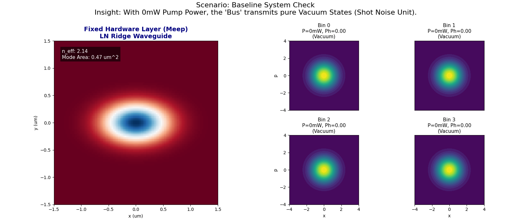
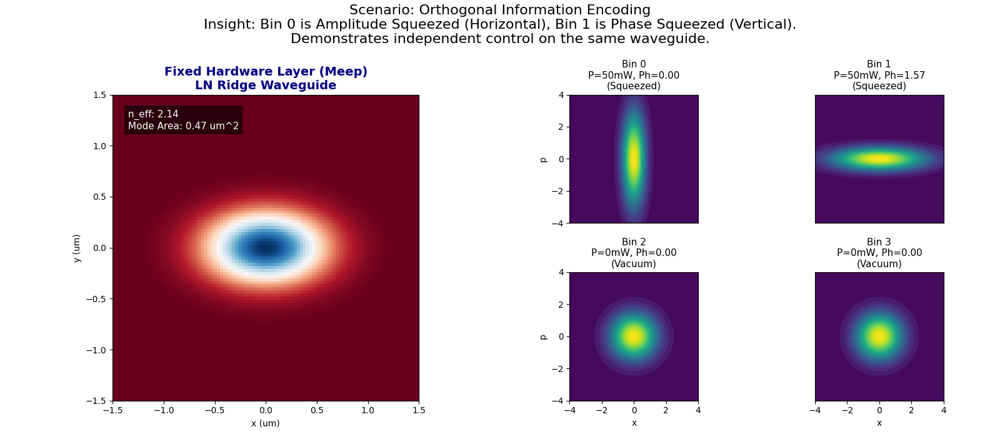
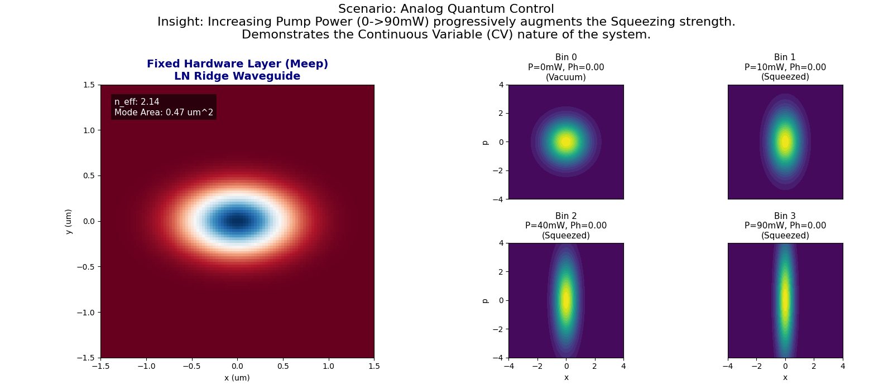

# Fixed Hardware, Dynamic Control: Quantum Optical Bus Simulation

A hybrid quantum-classical simulation demonstrating the concept of **"One Waveguide (Hardware), Infinite States (Software)"**.

This project implements a **Time-Division Multiplexed (TDM) Optical Bus** where dynamic quantum states are generated on a fixed Lithium Niobate (LN) waveguide using [Marimo](https://marimo.io) and [Strawberry Fields](https://strawberryfields.ai/).

## Key Features

- **Hardware Layer (Meep)**: Physics-based simulation of an LN Ridge Waveguide (1550nm).
- **Interface Layer**: Maps physical pump power to quantum squeezing parameters.
- **Application Layer (Strawberry Fields)**: Visualizes dynamic Time-bin encoding (Wigner Functions).
- **Reactive UI**: Control Power and Phase for 4 independent time-bins in real-time.

---

## 📸 Simulation Results

The following results demonstrate the system's capability to encode diverse quantum information on the same fixed hardware.

### 1. Baseline System Check (Vacuum)
**Scenario**: Pump Power = 0mW.
**Insight**: The bus transmits pure vacuum noise. The hardware is active but the signal is null.


### 2. Orthogonal Information Encoding
**Scenario**: Bin 0 (Amplitude Squeezed) vs Bin 1 (Phase Squeezed).
**Insight**: Demonstrates **Time-bin Encoding**. We encode completely orthogonal quantum states in adjacent time slots using the same physical device.


### 3. Analog Quantum Control (Gradient)
**Scenario**: Power gradient (0mW $\to$ 90mW).
**Insight**: The system supports **Continuous Variable (CV)** quantum information processing (Analog control), not just discrete bits.


---

## 🚀 How to Run

1.  **Install Dependencies**:
    ```bash
    # Using uv (recommended)
    uv pip install marimo strawberryfields numpy matplotlib scipy meep
    
    # Or standard pip
    pip install marimo strawberryfields numpy matplotlib scipy meep
    ```

2.  **Run the Simulation**:
    ```bash
    marimo edit squeezed_light.py
    ```
    This will open the interactive dashboard in your browser.

## Project Structure

- `squeezed_light.py`: The main simulation application (Marimo notebook).
- `generate_gallery.py`: Script to generate the result images.
- `simulation.py`: (Legacy) Basic physics simulation.
