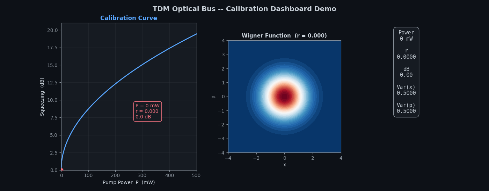
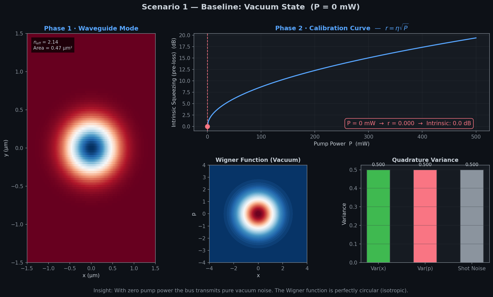
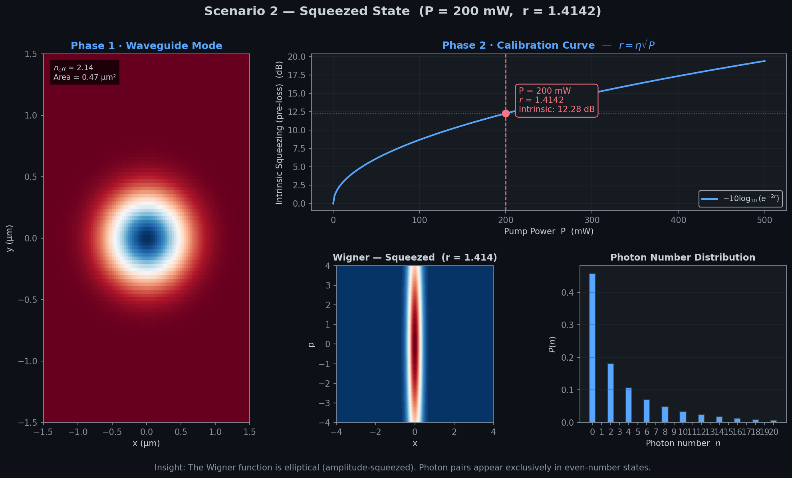
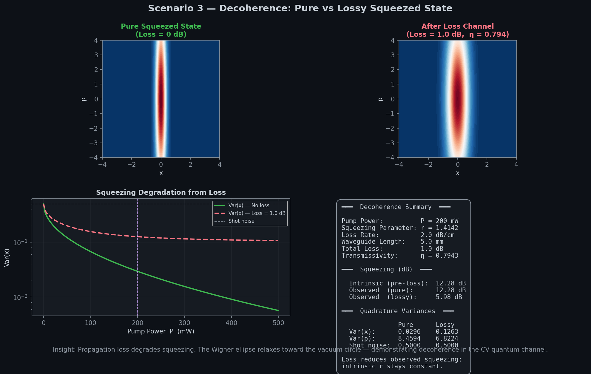

# Quantum Optical Bus — Calibration Dashboard

[](https://github.com/KumaHoon/physics_simulation/actions/workflows/ci.yml)

A hybrid quantum-classical simulation demonstrating **"One Waveguide (Hardware), Infinite States (Software)"** — with a **Calibration Dashboard** that exposes the physics mapping classical FDTD parameters to continuous-variable (CV) quantum states.

> **For Professors:** This project answers *"Did you calculate the actual squeezing parameter (r) based on the waveguide's material properties and geometry?"* — Yes. The calibration logic is transparent and interactive.

---

## 🎬 Live Demo

The dashboard sweeps pump power from 0 → 400 mW, showing the Wigner function evolving from vacuum (circular) to a squeezed state (elliptical) in real-time:



---

## 🔬 Calibration Dashboard

The dashboard follows a three-phase flow: **Hardware → Calibration → Quantum Result**.

### Phase 1 · The Device (LN Ridge Waveguide)
A Lithium Niobate waveguide at 1550 nm simulated via Meep FDTD (falls back to analytical Gaussian mode).

### Phase 2 · The Calibration Bridge
The core of the presentation — live LaTeX formulas showing:
- **Squeezing parameter:** $r = \eta \sqrt{P}$
- **Squeezing level:** $-10\log_{10}(e^{-2r})$ dB
- Interactive calibration curve with current operating point

### Phase 3 · Quantum Result
Three tabbed visualizations:
- **Wigner Function** — contour plot (becomes "fuzzier" with loss → decoherence)
- **Photon Number Distribution** — even-photon pairing from squeezed vacuum
- **Noise Variance** — squeezed/anti-squeezed quadratures vs shot noise limit

---

## 📸 Scenario Gallery

### 1. Baseline — Vacuum State (P = 0 mW)


### 2. Squeezed State (P = 200 mW)


### 3. Decoherence — Pure vs Lossy


---

## 🚀 How to Run

### Interactive Dashboard (Streamlit)
```bash
pip install -e .
streamlit run src/quantum_optical_bus/calibration_app.py
```
Then open **http://localhost:8501** in your browser.

### Marimo Notebook (Legacy)
```bash
pip install -e ".[full]"
marimo edit src/quantum_optical_bus/app.py
```

### Generate Gallery Images
```bash
python scripts/generate_dashboard_gallery.py
python scripts/generate_demo_gif.py
```

---

## 🏗️ Architecture

```
Input (Physics)  →  Calibration (Bridge)  →  Output (Quantum)
   Meep/FDTD           r = η√P              Strawberry Fields
```

| Layer | File | Responsibility |
|-------|------|----------------|
| **Hardware** | `hardware.py` | LN Ridge Waveguide mode simulation (Meep / mock) |
| **Interface** | `interface.py` | Pump power → squeezing parameter mapping |
| **Application** | `application.py` | Quantum Bus model (Strawberry Fields) |
| **Visualization** | `visualization.py` | Matplotlib plotting (BusVisualizer) |
| **Dashboard** | `calibration_app.py` | Streamlit presentation UI |

---

## 🧪 Testing & CI

Tests run on **Ubuntu, Windows, and macOS** via GitHub Actions:

```bash
pip install -e ".[test]"
pytest tests/ -v
```

---

## 📁 Project Structure

```
├── .github/workflows/ci.yml         # CI: Ubuntu / Windows / macOS
├── src/quantum_optical_bus/
│   ├── calibration_app.py            # Streamlit Calibration Dashboard
│   ├── app.py                        # Marimo notebook (legacy UI)
│   ├── hardware.py                   # Layer 1 — Meep / analytical mock
│   ├── interface.py                  # Layer 2 — Power → Squeezing
│   ├── application.py                # Layer 3 — Strawberry Fields
│   ├── visualization.py              # Matplotlib BusVisualizer
│   └── compat.py                     # Dependency patches
├── tests/test_core.py                # Pytest suite (11 tests)
├── scripts/
│   ├── generate_gallery.py           # Original gallery images
│   ├── generate_dashboard_gallery.py # Dashboard scenario images
│   └── generate_demo_gif.py          # Animated demo GIF
└── assets/                           # Generated images & demo
```
