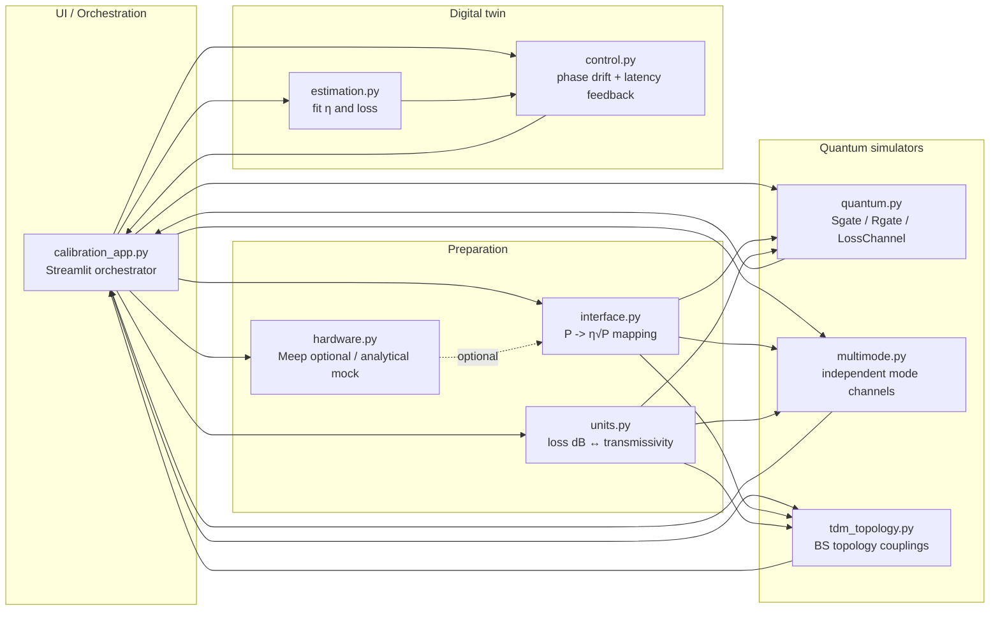

# Quantum Optical Bus - Calibration Dashboard

[](https://github.com/KumaHoon/Quantum-Optical-Bus-Simulation/actions/workflows/ci.yml)

English | [日本語](docs/README.ja.md) | [한국어](docs/README.ko.md) | [中文](docs/README.zh.md)

A hybrid quantum-classical simulation demonstrating **"One Waveguide (Hardware), Infinite States (Software)"**.
It includes a calibration dashboard that maps classical pump power to continuous-variable (CV) quantum states with explicit mapping
$r = \eta\sqrt{P}$, where this mapping is a proxy used by the current dashboard implementation.[^sqrtP_proxy]

---

## Live Demo

The dashboard sweeps pump power from 0 to 200 mW (squeezed ellipse forms),
then increases propagation loss from 0 to 2 dB (decoherence restores the circular
vacuum shape). **Loss does not change intrinsic *r*; it reduces observed squeezing.**

<p align="center">

</p>

> **Figure 1: Real-time Calibration Simulation.**
> The GIF shows intrinsic squeezing (pre-loss), which is constant for a fixed pump
> power, and observed squeezing (post-loss), which decreases as propagation loss
> increases.

This figure validates the mapping $r \propto \sqrt{P}$ and the decoherence
effect of the pure-loss channel.

---

## Architecture


```mermaid
flowchart LR
  subgraph UI["UI / Orchestration"]
    APP["calibration_app.py<br/>Streamlit orchestrator"]
  end

  subgraph PREP["Preparation"]
    H["hardware.py<br/>Meep optional / analytical mock"]
    I["interface.py<br/>P -> η√P mapping"]
    U["units.py<br/>loss dB ↔ transmissivity"]
  end

  subgraph CORE["Quantum simulators"]
    Q["quantum.py<br/>Sgate / Rgate / LossChannel"]
    M["multimode.py<br/>independent mode channels"]
    T["tdm_topology.py<br/>BS topology couplings"]
  end

  subgraph TWIN["Digital twin"]
    E["estimation.py<br/>fit η and loss"]
    C["control.py<br/>phase drift + latency feedback"]
  end

  APP --> I
  APP --> U
  APP --> H
  APP --> Q
  APP --> M
  APP --> T
  APP --> E
  APP --> C

  H -.optional.-> I
  I --> Q
  I --> M
  I --> T
  U --> Q
  U --> M
  U --> T
  Q --> APP
  M --> APP
  T --> APP
  E --> C
  C --> APP
```

The dashboard application (`calibration_app.py`) is the orchestrator:
it reads UI inputs, runs the computational modules, and renders Wigner functions,
quadrature plots, and control/fitting diagnostics.

### Responsibility table

| Layer | File | Responsibility |
|---|---|---|
| Hardware | `hardware.py` | Runs Meep eigenmode attempt when installed and always falls back to analytical Gaussian mock; returns fundamental-mode profile, effective index, and mode area. |
| Mapping | `interface.py` | Defines pump-power mapping used in dashboards: $r = \eta\sqrt{P}$. |
| Units | `units.py` | Converts dB loss to transmissivity (`db_to_eta`) and rescales covariance to vacuum=0.5 convention (`sf_cov_to_vacuum05`). |
| Quantum engine | `quantum.py` | `run_single_mode`: applies `Sgate`, optional `Rgate`, optional `LossChannel`, returns Wigner/covariance metrics (`mean_photon`, `var_x`, `var_p`, observed squeezing / anti-squeezing). |
| Multimode extension | `multimode.py` | `run_multimode`: per-mode independent `Sgate` / `Rgate` / `LossChannel` pipeline with optional Wigner extraction. |
| Topology extension | `tdm_topology.py` | `simulate_topology`: per-mode local gates plus ordered BS couplings from config, returns mode covariances and neighbor correlations. |
| Calibration / digital twin | `estimation.py` | `fit_eta_and_loss`: nonlinear fit of `eta` and loss to measured variance/squeezing curves. |
| Control loop | `control.py` | Simulates phase drift (`simulate_phase_drift`) and latency-limited feedback (`apply_feedback_with_latency`), outputs residual/error retention metrics. |
| Orchestrator UI | `calibration_app.py` | Streamlit app that wires all modules, computes derived quantities, and presents phase 1-4 workflows (hardware view, calibration, single-mode, multi-mode, topology, and digital twin). |

### Roadmap notes (source-based and current scope)

- `hardware.py` includes a hardware simulation path but does not drive the live
  calibration map $r$ in the current MVP.
- `interface.py` keeps the squeezing coupling $\eta$ as a phenomenological parameter
  rather than a value extracted from hardware overlap integrals.
- `tdm_topology.py` uses a static sequence of configured couplings in MVP form
  (no full timing jitter/hardware dispatch layer).

For more implementation details, assumptions, and module interaction notes, see
[`docs/ARCHITECTURE.md`](docs/ARCHITECTURE.md).

## Hardware-in-the-Loop Expansion

<p align="center">

</p>

> **Figure 2: Future Hardware-in-the-Loop expansion plan.**

The roadmap adds a hardware-aware loop:
- optical path (laser/OPA/loop/homodyne),
- control path (ADC/FPGA/DAC/EOM driver),
- world-model path (`estimation.py` -> updated controller coefficients -> `hdl` deployment).

---

## Scenario Gallery

| Scenario | Image |
|---|---|
| **1. Vacuum Baseline (P = 0 mW)** |  |
| **2. Squeezed State (P = 200 mW)** |  |
| **3. Decoherence (Pure vs Lossy)** |  |

### Scenario Gallery GIF

> **Figure 3: Scenario gallery animation.**

<p align="center">

</p>

## Advanced Gallery

| Scenario | Image |
|---|---|
| **4. Multi-mode / Time-bin Simulator** |  |
| **5. Topology Simulator** |  |
| **6. Digital Twin + Control** |  |

### Advanced Gallery GIF

> **Figure 4: Advanced gallery animation.**

<p align="center">

</p>

## Evidence Gallery

### Advanced Evidence GIF

> **Figure 5: Advanced evidence summary animation.**

<p align="center">

</p>

---

## Quick Start

```bash
# Install
pip install -e .

# Launch dashboard
streamlit run src/quantum_optical_bus/calibration_app.py
```

Then open **http://localhost:8501** and use the sidebar sliders.

### Docker Quick Start

Tested for Docker runtime with **Python 3.10** (Strawberry Fields compatibility).

```bash
docker build .
docker compose up --build
```

Then open **http://localhost:8501**.

### Language Notes

See translation versions in `docs/README.ja.md`, `docs/README.ko.md`, and `docs/README.zh.md`.

### Additional Commands

| Task | Command |
|---|---|
| Generate Gallery Images | `python scripts/generate_dashboard_gallery.py` |
| Generate Advanced Gallery Images | `python scripts/generate_advanced_dashboard_gallery.py` |
| Generate Scenario Gallery GIF | `python scripts/generate_scenario_gallery_gif.py` |
| Generate Advanced Gallery GIF | `python scripts/generate_advanced_gallery_gif.py` |
| Generate Advanced Evidence GIF | `python scripts/generate_advanced_evidence_gif.py` |
| Generate HIL Infographic | `python scripts/generate_hil_infographic.py` |
| Generate Demo GIF | `python scripts/generate_calibration_demo.py` |

Topology config example:

```bash
python -c "from quantum_optical_bus.tdm_topology import simulate_topology; print(simulate_topology('examples/topology_chain.json').observed_sq_db)"
```

### Task Runner

This repository includes a minimal `Makefile`:

```bash
make test   # run pytest
make lint   # lightweight checks (python -m compileall src tests)
make app    # launch Streamlit dashboard
```

If `make` is unavailable (common on Windows shells), run:

```bash
python -m pytest -q
python -m compileall src tests
streamlit run src/quantum_optical_bus/calibration_app.py
```

---

## Model Definitions and Assumptions

### Squeezing parameter and control knob

The squeezing parameter is mapped from pump power:

$$r = \eta\sqrt{P}$$
where this is a phenomenological control proxy, not yet a full hardware-derived parameter estimate.[^sqrtP_proxy]

where $\eta = 0.1$ is a placeholder coupling coefficient so that 100 mW approximates $r\approx 1.0$.
This is the source-side knob and is independent of downstream loss.

For a single-mode squeezed vacuum state, quadrature variance scales with the squeezing
parameter as $V_x \propto e^{-2r}$ and $V_p \propto e^{+2r}$ (up to convention),
which we use here as a modeling convention for visualization and diagnostics.[^squeezing_vacuum]

### Loss model

Propagation and detection losses are modeled as a pure-loss channel applied after squeezing:

$$T = 10^{-\text{loss\_dB}/10}$$
This is the inverse conversion used by our dashboard helper utilities; the forward
relation for reporting power loss is ${\rm loss}_{\rm dB} = -10\log_{10}(T)$.[^db_conversion]

and the channel model is

$$\hat{a}_{\text{out}} = \sqrt{T}\,\hat{a}_{\text{in}} + \sqrt{1-T}\,\hat{a}_{\text{vac}}$$

Observed squeezing is derived from output covariances and tends to zero as $T \to 0$.

[^sqrtP_proxy]: Proxy mapping for this repository's calibration demo:  
    Squeezing lab manual for OPA characterization and power-law fitting guidance,
    https://indico.fysik.su.se/event/9433/contributions/14609/attachments/6285/8488/Squeezing_Lab_Manual_WACQT_Lab%20%281%29.pdf

[^squeezing_vacuum]: Quadrature-variance scaling in squeezed vacuum (with common conventions),
    https://mx.nthu.edu.tw/~rklee/files/QO-note-squeezed.pdf

[^db_conversion]: Standard power/attenuation conversion in dB used with the same laboratory notes:  
    https://indico.fysik.su.se/event/9433/contributions/14609/attachments/6285/8488/Squeezing_Lab_Manual_WACQT_Lab%20%281%29.pdf

### Honest notes about placeholders

- `hardware.py` is optional Meep integration with analytic fallback; it is not yet a full production-calibration extractor.
- `interface.py` uses a fixed coupling map rather than measured overlap-based calibration.
- `tdm_topology.py` models an ordered static inter-bin coupling list with per-mode loss; it does not yet include full waveform/clock coupling effects.
- `multimode.py` is per-bin independent by design in the current version.
- `estimation.py` and `control.py` are MVP-level fitting + simplified drift/latency routines intended for study workflows.

## Testing & CI

Tests run on Ubuntu, Windows, and macOS via GitHub Actions.
Tested on Python 3.10 due to Strawberry Fields support.

```bash
pip install -e ".[test]"
python -m pytest -q
```

Roadmap and phased acceptance criteria are documented in `docs/ROADMAP.md`.

---

## Project Structure

```
.
+-- .github/workflows/ci.yml           # CI: Ubuntu / Windows / macOS
+-- src/
    +-- quantum_optical_bus/
        +-- calibration_app.py         # Streamlit calibration dashboard
        +-- quantum.py                 # Single-mode Gaussian circuit helper
        +-- multimode.py               # Independent multi-mode/time-bin Gaussian core
        +-- tdm_topology.py            # Config-driven topology + BS couplings
        +-- estimation.py              # Digital twin fitting (eta/loss)
        +-- control.py                 # Drift and latency control simulation
        +-- hardware.py                # Meep / analytical mock interface
        +-- interface.py               # Power->squeezing mapping
        +-- units.py                   # Units helpers and loss conversion
        +-- compat.py                  # Dependency patches
+-- tests/
    +-- test_core.py                   # Core simulator tests
    +-- test_digital_twin.py           # Estimation/control tests
+-- scripts/
    +-- generate_calibration_demo.py   # Animated demo GIF
    +-- generate_dashboard_gallery.py  # Baseline scenario images
    +-- generate_advanced_dashboard_gallery.py # Multi-mode/topology/digital twin images
    +-- ...                           # GIF and evidence generators
+-- assets/                            # Generated images and demo artifacts
```


