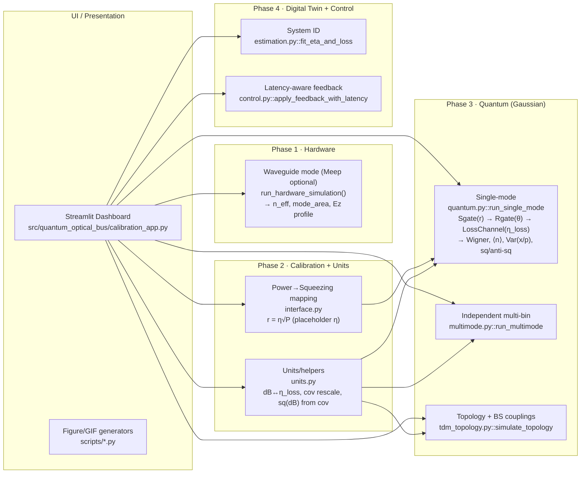

# Quantum Optical Bus - Calibration Dashboard [](https://github.com/KumaHoon/Quantum-Optical-Bus-Simulation/actions/workflows/ci.yml)

**Languages:** [English](README.md) | [日本語](docs/README.ja.md) | [한국어](docs/README.ko.md) | [中文](docs/README.zh.md)

A hybrid quantum-classical simulation demonstrating **"One Waveguide (Hardware), Infinite States (Software)"**.  
It includes a **Calibration Dashboard** that maps classical pump power to continuous-variable (CV) quantum states with an explicit squeezing calibration $r = \eta\sqrt{P}$.

---

## Live Demo

The dashboard sweeps pump power from 0 to 200 mW (squeezed ellipse forms), then increases propagation loss from 0 to 2 dB (decoherence restores the circular vacuum shape). **Loss does not change intrinsic *r*; it reduces observed squeezing (post-loss).**

<p align="center"></p>

> **Figure 1: Real-time Calibration Simulation.**
> The GIF shows both **intrinsic squeezing (pre-loss)** — constant for a given pump power — and **observed squeezing (post-loss)**, which decreases as propagation loss increases. This visually verifies the $r \propto \sqrt{P}$ mapping and the decoherence effect of the pure-loss channel.

---

## Architecture


```mermaid
flowchart LR
  subgraph UI["UI / Presentation"]
    APP["Streamlit Dashboard\nsrc/quantum_optical_bus/calibration_app.py"]
    FIG["Figure/GIF generators\nscripts/*.py"]
  end

  subgraph HW["Phase 1 · Hardware"]
    H["Waveguide mode (Meep optional)\nrun_hardware_simulation()\n→ n_eff, mode_area, Ez profile"]
  end

  subgraph CAL["Phase 2 · Calibration + Units"]
    I["Power→Squeezing mapping\ninterface.py\nr = η√P (placeholder η)"]
    U["Units/helpers\nunits.py\ndB↔η_loss, cov rescale, sq(dB) from cov"]
  end

  subgraph QM["Phase 3 · Quantum (Gaussian)"]
    Q1["Single-mode\nquantum.py::run_single_mode\nSgate(r) → Rgate(θ) → LossChannel(η_loss)\n→ Wigner, ⟨n⟩, Var(x/p), sq/anti-sq"]
    Q2["Independent multi-bin\nmultimode.py::run_multimode"]
    Q3["Topology + BS couplings\ntdm_topology.py::simulate_topology"]
  end

  subgraph DT["Phase 4 · Digital Twin + Control"]
    E["System ID\nestimation.py::fit_eta_and_loss"]
    C["Latency-aware feedback\ncontrol.py::apply_feedback_with_latency"]
  end

  APP --> H
  APP --> I
  APP --> U
  APP --> Q1
  APP --> Q2
  APP --> Q3
  APP --> E
  APP --> C

  I --> Q1
  U --> Q1
  U --> Q2
  U --> Q3
```

| Layer | File | Responsibility |
|-------|------|----------------|
| **Hardware** | `hardware.py` | LN ridge waveguide mode profile simulation (Meep / analytical mock). Currently used for display and future eta-extraction research; it does not yet drive the squeezing map in the current MVP. |
| **Interface** | `interface.py` | Pump power `P -> r` via the configured phenomenological mapping ($r = \eta\sqrt{P}$). |
| **Units** | `units.py` | Converts total loss in dB to transmissivity `eta_loss`. |
| **Quantum** | `quantum.py` | `run_single_mode`: `Sgate`, `Rgate`, `LossChannel` -> Wigner and metric outputs (`mean_photon`, `var_x`, `var_p`, observed squeezing). |
| **Multimode** | `multimode.py` | `run_multimode`: independent per-bin mode evolution with squeezing, rotation, and loss. |
| **Topology** | `tdm_topology.py` | `simulate_topology`: ordered BSgate couplings and mode/correlation propagation. |
| **Estimation** | `estimation.py` | `fit_eta_and_loss`: calibration-only fitting used by digital twin workflow. |
| **Control** | `control.py` | `apply_feedback_with_latency`: phase-drift recovery and latency control helper. |
| **HIL Hooks** | `hdl/` | Future deployment boundary for real-time feedback coefficients and timing-aware actuation. |
| **Compat** | `compat.py` | Dependency patches (pkg_resources, scipy) |
| **Dashboard** | `calibration_app.py` | Streamlit calibration UI that orchestrates inputs and renders outputs |

The hardware simulation remains a current **display/demo layer** (and future eta-extraction pathway); it does not determine $r$ directly in the current MVP.
`eta_loss` is currently a placeholder derived from user-entered loss settings (converted in `units.py`), with roadmap work planned to connect overlap-integral-derived transmissivity from hardware.

## Hardware-in-the-Loop Expansion

<p align="center"></p>

The roadmap adds a compact hardware-aware loop:
- optical data path (laser/OPA/loop/homodyne),
- control path (ADC/FPGA/DAC/EOM driver),
- world-model path (logs → `estimation.py` → updated controller coefficients → `hdl/` deployment).

---

## Calibration Dashboard

The dashboard follows a four-phase flow: **Hardware → Calibration + Units → Quantum (Gaussian) → Digital Twin + Control**.

### Phase 1 · The Device (LN Ridge Waveguide)
A Lithium Niobate waveguide at 1550 nm simulated via Meep FDTD (falls back to analytical Gaussian mode).

### Phase 2 · The Calibration Bridge
The core of the presentation — live LaTeX formulas showing:
- **Squeezing parameter:** $r = \eta \sqrt{P}$
- **Intrinsic squeezing (pre-loss):** $-10\log_{10}(e^{-2r})$ dB — depends only on pump power
- **Observed squeezing (post-loss):** from output covariance eigenvalues after the loss channel
- Interactive calibration curve with current operating point

### Phase 3 · Quantum Result
Three tabbed visualizations:
- **Wigner Function** — contour plot (becomes "fuzzier" with loss → decoherence)
- **Photon Number Distribution** — even-photon pairing from squeezed vacuum
- **Noise Variance** — squeezed/anti-squeezed quadratures vs shot noise limit

---

## Scenario Gallery

| Scenario | Image |
|----------|-------|
| **1. Vacuum Baseline** (P = 0 mW) |  |
| **2. Squeezed State** (P = 200 mW) |  |
| **3. Decoherence** (Pure vs Lossy) |  |

<details>
<summary>Scenario Gallery GIF</summary>

<p align="center"></p>

</details>

## Advanced Gallery

| Scenario | Image |
|----------|-------|
| **4. Multi-mode / Time-bin Simulator** |  |
| **5. Topology Simulator** |  |
| **6. Digital Twin + Control** |  |

<details>
<summary>Advanced Gallery GIF</summary>

<p align="center"></p>

</details>

## Evidence Gallery

<details>
<summary>Advanced Evidence GIF</summary>

<p align="center"></p>

</details>

---

## Quick Start

```bash
# Install
pip install -e .

# Launch dashboard
streamlit run src/quantum_optical_bus/calibration_app.py
```

Open **http://localhost:8501** and use the sidebar sliders to adjust pump power, phase, and loss — watch the quantum state update in real-time.

### Docker Quick Start

Tested for Docker runtime with **Python 3.10** (Strawberry Fields compatibility).

```bash
docker build .
docker compose up --build
```

Then open **http://localhost:8501**.

### Language Notes

See translation versions in `docs/README.ja.md`, `docs/README.ko.md`, and `docs/README.zh.md`.

### Additional Commands

| Task | Command |
|------|---------|
| Generate Gallery Images | `python scripts/generate_dashboard_gallery.py` |
| Generate Advanced Gallery Images | `python scripts/generate_advanced_dashboard_gallery.py` |
| Generate Scenario Gallery GIF | `python scripts/generate_scenario_gallery_gif.py` |
| Generate Advanced Gallery GIF | `python scripts/generate_advanced_gallery_gif.py` |
| Generate Advanced Evidence GIF | `python scripts/generate_advanced_evidence_gif.py` |
| Generate HIL Infographic | `python scripts/generate_hil_infographic.py` |
| Generate Demo GIF | `python scripts/generate_calibration_demo.py` |

Topology config example:

```bash
python -c "from quantum_optical_bus.tdm_topology import simulate_topology; print(simulate_topology('examples/topology_chain.json').observed_sq_db)"
```

### Task Runner

This repository includes a minimal `Makefile`:

```bash
make test   # run pytest
make lint   # lightweight checks (python -m compileall src tests)
make app    # launch Streamlit dashboard
```

If `make` is unavailable (common on Windows shells), run equivalent commands directly:

```bash
python -m pytest -q
python -m compileall src tests
streamlit run src/quantum_optical_bus/calibration_app.py
```

---

## 📐 Model Definitions and Assumptions

### Squeezing parameter — source knob

The squeezing parameter **r** is a phenomenological mapping from pump power: [^opa_whitepaper]

$$r = \eta \sqrt{P}$$

where $\eta = 0.1$ is a coupling efficiency placeholder (tuned so 100 mW → r ≈ 1.0).
This is a **source-level knob** — it controls how much squeezing the nonlinear process
generates, independent of any downstream losses. [^sq_weedbrook] [^sq_sgate]

### Loss model

Propagation and detection losses are modelled as a **separate pure-loss channel**
applied *after* squeezing. [^loss_sf] [^loss_gaussian] [^loss_lecture]  The channel transmissivity is: [^db_itu]

$$T = 10^{-\text{loss\_dB}/10}$$

This corresponds to a beam-splitter mixing the signal with vacuum:

$$\hat{a}_{\text{out}} = \sqrt{T}\,\hat{a}_{\text{in}} + \sqrt{1-T}\,\hat{a}_{\text{vac}}$$

### Intrinsic vs Observed squeezing

| Metric | Definition | Depends on loss? |
|--------|-----------|-----------------|
| **Intrinsic squeezing (pre-loss)** | $-10\log_{10}(e^{-2r})$ — computed from *r* only [^db_def] | No |
| **Observed squeezing (post-loss)** | $-10\log_{10}(V_{\min}/V_{\text{vac}})$ — from output covariance eigenvalues [^gaussian_decomp] [^sf_cov_doc] | Yes |

Analytic intuition (single-mode Gaussian):

$$V_{\text{out}} = T \cdot V_{\text{in}} + (1-T) \cdot V_{\text{vac}}, \quad V_{\text{vac}} = \tfrac{1}{2}$$

As $T \to 0$ (total loss), $V_{\text{out}} \to V_{\text{vac}}$ and observed squeezing → 0 dB.

> **Note:** Strawberry Fields uses $\hbar=2$ by default ($V_{\text{vac}}=1$).
> We rescale by ½ when reporting results in the common $V_{\text{vac}}=\tfrac{1}{2}$ convention. [^sf_hbar] [^sf_cov_doc]

### Honest notes about placeholders

- **Coupling efficiency** ($\eta$): currently a fixed constant.  In a real device this
  would be calibrated from overlap integrals; tuning infrastructure is stubbed out.
- **Meep FDTD**: the hardware layer falls back to an analytical Gaussian mode profile
  when Meep is not installed.  The mode data is qualitatively correct but not
  quantitatively validated against full 3-D FDTD.
- **Time-bin modeling split**:
  `multimode.py` provides independent per-bin Gaussian evolution (Sgate/Rgate/Loss),
  while `tdm_topology.py` adds inter-bin coupling via `BSgate` from a config.
- **Topology/control simplifications**: coupling is an ordered static gate list with
  per-bin/per-edge loss and phase shifts; it does not yet model pulse-shape effects,
  higher-order nonlinearities, or full hardware-in-the-loop timing jitter.
- **Digital twin scope**: `estimation.py` and `control.py` are MVP-level
  least-squares fitting + latency/drift simulation, intended for calibration studies
  rather than a full production control stack.

### References / Notes

We model single-mode squeezing and loss using standard continuous-variable (Gaussian) quantum optics, implemented with Strawberry Fields (Gaussian backend).

[^sq_weedbrook]: C. Weedbrook *et al.*, "Gaussian quantum information" ([arXiv:1110.3234](https://arxiv.org/pdf/1110.3234)), single-mode squeezing operator and symplectic map.

[^sq_sgate]: Strawberry Fields API: [`sf.ops.Sgate`](https://strawberryfields.readthedocs.io/en/latest/code/api/strawberryfields.ops.Sgate.html) — definition + quadrature scaling.

[^db_def]: Max Planck Institute lecture note ["From nonlinear optical effects to squeezing"](https://mpl.mpg.de/fileadmin/user_upload/Lecture_2_8.pdf) — definition of quadrature squeezing in dB.

[^loss_sf]: Strawberry Fields API: [`sf.ops.LossChannel`](https://strawberryfields.readthedocs.io/en/latest/code/api/strawberryfields.ops.LossChannel.html) — beamsplitter-with-vacuum model.

[^loss_gaussian]: C. Weedbrook *et al.*, "Gaussian quantum information" ([arXiv:1110.3234](https://arxiv.org/pdf/1110.3234)), lossy Gaussian channels via coupling to vacuum.

[^loss_lecture]: Max Planck Institute lecture note ["From nonlinear optical effects to squeezing"](https://mpl.mpg.de/fileadmin/user_upload/Lecture_2_8.pdf) — loss/efficiency as a beamsplitter.

[^db_itu]: ITU-R Rec. V.574-5, ["Use of the decibel and the neper in telecommunications"](https://www.itu.int/dms_pubrec/itu-r/rec/v/R-REC-V.574-5-201508-I%21%21PDF-E.pdf) — $10\log_{10}$ power ratios.

[^gaussian_decomp]: C. Weedbrook *et al.*, "Gaussian quantum information" ([arXiv:1110.3234](https://arxiv.org/pdf/1110.3234)), one-mode covariance decomposition.

[^sf_hbar]: Strawberry Fields docs: [default $\hbar=2$ convention](https://strawberryfields.readthedocs.io/en/latest/introduction/ops.html).

[^sf_cov_doc]: Strawberry Fields: [`GaussianState.cov()`](https://strawberryfields.readthedocs.io/en/stable/_modules/strawberryfields/backends/states.html) — covariance meaning and relation to squeezing.

[^opa_whitepaper]: JST IMPACT whitepaper ["Physics of Optical Parametric Oscillator Network"](https://www.jst.go.jp/impact/hp_yamamoto/en/technical/pdf/white_2.pdf) — parametric amplification equations; power ∝ |b|² and exponential gain vs pump amplitude.

---

## 🧪 Testing & CI

Tests run on **Ubuntu, Windows, and macOS** via GitHub Actions.

Tested on **Python 3.10** due to Strawberry Fields support.

```bash
pip install -e ".[test]"
python -m pytest -q
```

You can also use:

```bash
make test
```

Roadmap and phased acceptance criteria are documented in `docs/ROADMAP.md`.

---

## 📁 Project Structure

```
├── .github/workflows/ci.yml           # CI: Ubuntu / Windows / macOS
├── src/quantum_optical_bus/
│   ├── calibration_app.py              # Streamlit Calibration Dashboard
│   ├── quantum.py                      # Shared single-mode Gaussian circuit
│   ├── multimode.py                    # Independent multi-mode/time-bin Gaussian core
│   ├── tdm_topology.py                 # Config-driven topology + BSgate coupling
│   ├── estimation.py                   # Digital twin parameter fitting (eta/loss)
│   ├── control.py                      # Drift + latency feedback simulation
│   ├── hardware.py                     # Meep / analytical mock
│   ├── interface.py                    # Power → Squeezing mapping
│   └── compat.py                       # Dependency patches
├── tests/test_core.py                  # Core simulator and dashboard-facing tests
├── tests/test_digital_twin.py          # Estimation/control regression tests
├── scripts/
│   ├── generate_calibration_demo.py    # Animated demo GIF
│   ├── generate_dashboard_gallery.py   # Baseline dashboard scenario images
│   └── generate_advanced_dashboard_gallery.py  # Multimode/topology/digital twin images
└── assets/                             # Generated images & demo
```

