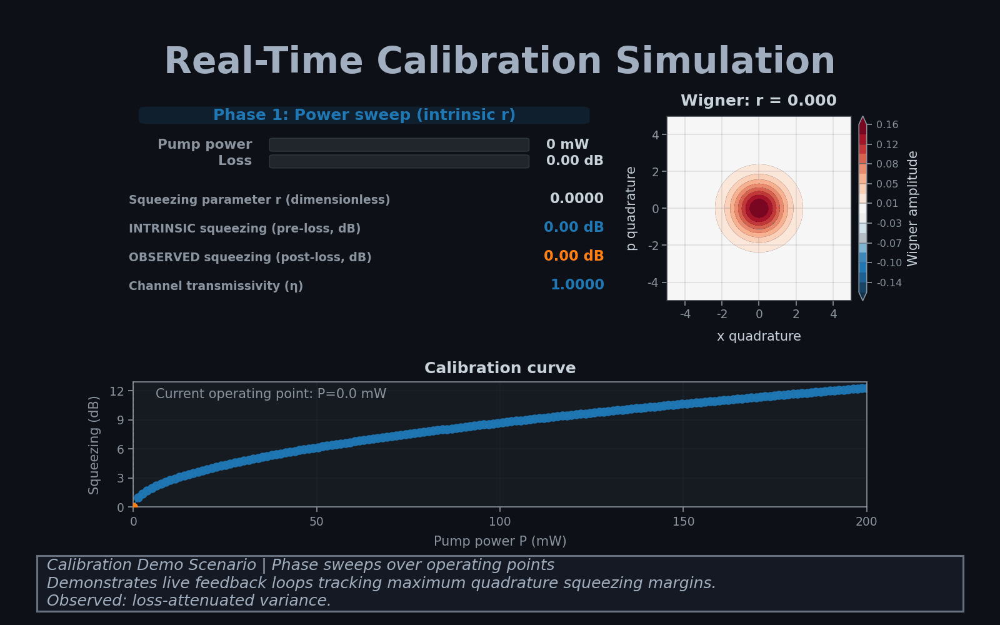
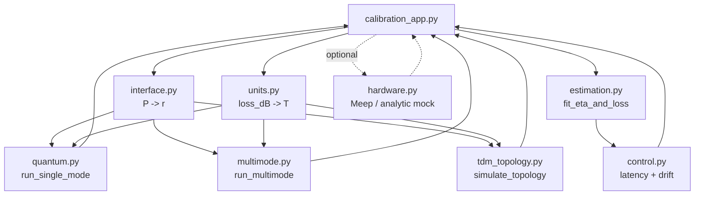

# Quantum Optical Bus Simulation - Calibration Dashboard
[](https://github.com/KumaHoon/Quantum-Optical-Bus-Simulation/actions/workflows/ci.yml)

English

A hybrid quantum--classical **simulation + Streamlit dashboard** for exploring how a classical control knob (pump power) maps to continuous-variable (CV) **squeezed states**, and how propagation/detection loss reduces **observed** squeezing.
This repository targets **loop-based / time-domain-multiplexed optical quantum workflows**, where squeezed-state generation and homodyne measurement are coupled with model identification and control updates. The closed-loop path (**measurement -> estimation -> control**) is represented explicitly as a reproducible **digital-twin + control pipeline**.

## Documents (review boundary)

### Core (README route)
- `docs/PROJECT_SPEC.md`
- `docs/figure_checklist.md`
- `docs/EVIDENCE_PACK.md`
- `docs/ARCHITECTURE.md`
- `docs/data_schema.md`

### Roadmap / Appendix
- `docs/ROADMAP.md`
- `docs/REFERENCES.md`

### Archive (non-binding)
- `docs/AUDIT_REPORT.md`
- `docs/RELEASE_NOTES.md`
- `docs/APPENDIX_GKP.md` (retained for historical reference only)

## Platform note

Platform note: The control-evidence pattern (latency/quantization sweeps + fixed-point HDL contract + reproducible artifacts) is platform-agnostic and can be adapted to other measurement/control chains (e.g., microwave or hybrid systems).

> **Core idea (white-box):** separate **intrinsic** squeezing (set by the source parameter `r`) from **observed** squeezing (after a pure-loss channel).

---

## Reading guide (for busy reviewers)

- **30 seconds:** [What it is](#what-it-is-30-seconds) + [Run it now](#run-it-now-30-seconds) + [Live demo](#live-demo)
- **3 minutes:** [Scope (Implemented vs Roadmap)](#scope-implemented-vs-roadmap) + [Research-ready onboarding story](#research-ready-onboarding-story) + [Architecture](#architecture)
- **10 minutes:** [Model assumptions](#model-assumptions-10-minutes) + [Reproducing figures / artifacts](#reproducing-figures--artifacts) + `docs/ARCHITECTURE.md`
- **MVP acceptance note:** mandatory review claims are limited to Core documents and checklist items above; roadmap/appendix artifacts are excluded from MVP evidence gates.

### 30s/3min reviewer route

- **0:00-0:30 (Rapid review pass)**
  1. Confirm the one-line problem statement and core contribution in [What it is](#what-it-is-30-seconds).
  2. Check run-readiness via [Run it now](#run-it-now-30-seconds) (or open the live demo).
  3. In [Live demo](#live-demo), validate these three points:
     - intrinsic vs observed separation
     - observed squeezing decreases as loss increases
     - Wigner and distribution are physically consistent
  4. For implementation-focused verification: track proxy metrics for `(intrinsic-observed) squeeze`, RMS phase residual, and retention against baseline.
- **0:30-1:00 (FPGA evidence verification check)**
  1. In [FPGA evidence check](#fpga-evidence-check-30-second-routine), verify fixed-point contract + RTL evidence.
  2. Check `hdl/vectors/contract.json`, `.mem` files, and VCD output.
  3. Confirm manifest reports `Q1.15` and 2-cycle latency.
- **1:00-3:00 (Technical trust check)**
  1. In [Scope (Implemented vs Roadmap)](#scope-implemented-vs-roadmap), confirm implemented vs deferred scope.
  2. In [Research-ready onboarding story](#research-ready-onboarding-story), verify the roadmap for `data/raw` -> `fit_lab_data.py` -> regenerate loop.
  3. In [Architecture](#architecture), verify loop-based/closed-loop path (measurement -> estimation -> control).
  4. In [Figure policy](#figure-policy-review-friendly), confirm axis/label/unit consistency for key PNG/GIFs (`dashboard_*`, `sweep_*`, `drift_recovery`).

Recommendation: run the 3-minute route and then check remaining items in `docs/figure_checklist.md` under its `30s / 3min` route section.

---

<a id="what-it-is-30-seconds"></a>
## What it is (30 seconds)

This repository provides:

- A **Streamlit dashboard** (`src/quantum_optical_bus/calibration_app.py`) to visualize squeezed-state calibration and loss-driven decoherence.
- A **Gaussian CV simulation core** powered by **Strawberry Fields** (Gaussian backend).
- Extensions for:
  - **multi-mode/time-bin** (independent modes),
  - **topology simulation** with beam-splitter couplings,
  - an MVP **digital twin** (fit `(eta, loss)` from data),
  - a toy **latency-aware feedback** model for phase drift.

---

<a id="run-it-now-30-seconds"></a>
## Run it now (30 seconds)

### Option A - Docker (recommended, lowest friction)

```bash
docker compose up --build
```

Open: **[http://localhost:8501](http://localhost:8501)**

### Option B - Local install (Python 3.10)

> This project targets **Python 3.10** (Strawberry Fields compatibility).

```bash
python3.10 -m venv .venv
source .venv/bin/activate
python -m pip install -U pip

# core install
pip install -e .

# (optional) extras for dashboard/GIF generation + tests
pip install -e ".[demo,test]"

make app
```

`make app` is the simplest local start. For package-level workflows:

```bash
python -m quantum_optical_bus app
qobus-build --profile both --target advisor
qobus-verify --profile both --target advisor
```

---

<a id="live-demo"></a>
## Live demo

The demo shows:

1. pump power sweep -> ellipse forms (intrinsic squeezing increases)
2. loss sweep -> ellipse collapses toward vacuum (observed squeezing decreases)



> **Figure 1. Calibration demo.** Intrinsic squeezing is set by the source parameter `r` (proxy mapping from pump power).
> Observed squeezing is computed **after** the loss channel and decreases monotonically with increasing loss.

---

<a id="scope-implemented-vs-roadmap"></a>
## Scope (Implemented vs Roadmap)

### Implemented (current version)

* [x] **Proxy mapping** from pump power to squeezing: `r = eta * sqrt(P)` (phenomenological placeholder)
* [x] **Single-mode Gaussian circuit**: `Sgate`, `Rgate`, `LossChannel` -> Wigner + covariance metrics
* [x] Explicit **intrinsic vs observed** squeezing reporting
* [x] Multi-mode / time-bin simulator (independent modes)
* [x] Topology simulator (config-driven beam-splitter couplings + per-mode loss)
* [x] MVP **digital twin estimation**: fit `(eta, loss_db)` from variance/squeezing curves
* [x] Toy **latency-aware feedback** for phase drift
* [x] Single-command artifact generation and verification scripts
* [x] Scripts for web/paper artifact generation
* [x] Scripts to generate **gallery PNG/GIF** artifacts + CI tests

### Not yet implemented (roadmap items)

* [ ] Hardware-derived `eta` from overlap integrals / chi(2) / measured calibration data (closing the loop from hardware to `r`)
* [ ] Full timing/clock/jitter model and a real actuator dispatch layer
* [ ] Non-Gaussian effects (pump depletion, higher-order processes, etc.)
* [ ] Full hardware-in-the-loop deployment path (`hdl/`) in a closed loop
* [ ] Full loop-based hardware-in-the-loop stack (loop-platform-ready target), including closed-loop actuation and hardware telemetry.
* [ ] Data-to-control pipeline (`data/raw` -> `fit_lab_data.py` -> rebuild artifacts via `build_assets_profiles.py`) as a roadmap implementation item.

### Non-goals (explicit)

- No claims of equivalence to a complete experimental stack in this MVP.
- No board-level FPGA bring-up path (HDL simulation + manifest-based verification only).
- No cluster-scale routing/scheduler/MBQC compiler; control scope is currently loop-based calibration and drift automation.

See: `docs/ROADMAP.md`

---

<a id="architecture"></a>
## Architecture

### 1) System view (Context / Containers)

```mermaid
flowchart LR
  User[Researcher / Operator] --> UI[Streamlit dashboard<br/>calibration_app.py]
  UI --> Core[quantum_optical_bus<br/>Python package]

  Core --> SF[Strawberry Fields<br/>Gaussian backend]
  Core -.->|optional| Meep["Meep (optional)"]

  Core --> UI
  Scripts[scripts/*] --> Assets[assets/web/* and assets/paper/* (PNG/GIF)]
```

**Boundary note:** in the current MVP, the Meep path is **not** used to compute `r`; it is a hardware-view placeholder and a future integration hook.

### 2) Component view (Hot path + extensions)


```mermaid
flowchart TD
  UI[calibration_app.py] --> Map[interface.py<br/>P -> r]
  UI --> Units[units.py<br/>loss_dB -> T]

  Map --> SM[quantum.py<br/>run_single_mode]
  Units --> SM
  SM --> UI

  Map --> MM[multimode.py<br/>run_multimode]
  Units --> MM
  MM --> UI

  Map --> Topo[tdm_topology.py<br/>simulate_topology]
  Units --> Topo
  Topo --> UI

  UI --> Est[estimation.py<br/>fit_eta_and_loss]
  Est --> Ctrl[control.py<br/>latency + drift]
  Ctrl --> UI

  UI -.->|optional| HW["hardware.py<br/>Meep / analytic mock"]
  HW -.-> UI
```

More details: `docs/ARCHITECTURE.md`

---

## Gallery (auto-generated artifacts)

> These figures are auto-generated from scripts in `scripts/`.
> If any figure looks "tight" (text near edges), regenerate with the latest script settings and review layout before using in a paper/slide.
> For MVP acceptance, reviewer-visible acceptance points are taken from the `assets/web` MVP subset.

### <a id="figure-policy-review-friendly"></a>Figure policy (review-friendly)

Use this section as the first-pass evidence layer.

- Core figure policy:
  - prioritize one claim per figure (single-message)
  - prefer `assets/web` for review, `assets/paper` only after approval
  - labels, legends, and units must be readable without context lookup
  - avoid color-only encoding and avoid decorative clutter
  - use redundant encoding (line/marker/labels) for critical comparisons
- Alignment reference: `docs/figure_checklist.md`, `docs/FIGURE_STYLE.md`, and `docs/FIGURE_CONTRACT.yaml` (Zabala-inspired rubric + hard style/metadata contract).

### Core evidence (3-minute path)

- **Primary claim (30 sec / 3 min):**
  - Calibration dynamics + intrinsic/observed behavior: `assets/web/calibration_demo.gif`
  - Decoherence realism: `assets/web/dashboard_decoherence.png`
  - Control-constraint sensitivity: `assets/web/sweep_latency.png` (or `assets/web/sweep_quantization.png`), both validated under advisor/MVP profile

Interpretation cue:
- one figure, one message; one reviewer pass in ~3 minutes.

See `docs/EVIDENCE_PACK.md` for full claim -> evidence -> limitation mapping.

<details>
<summary><b>Extensions (optional)</b></summary>

- `assets/web/dashboard_multimode.png` (multi-mode / time-bin)
- `assets/web/dashboard_topology.png` (topology simulator)
- `assets/web/dashboard_digital_twin.png` (digital twin + control)
- `assets/web/drift_recovery.png` (24h recovery behavior)

</details>

<details>
<summary><b>Appendix</b></summary>

- `docs/APPENDIX_GKP.md` (appendix-only, non-MVP)

</details>

> Roadmap visuals (for example: `gkp_proxy`, scenario/advanced gallery GIFs, and advanced evidence scripts) are excluded from MVP review path.

### Paper assets

`python scripts/build_assets_profiles.py --profile both --target advisor` followed by `--verify` renders publication-oriented versions with white background and print-safe typography into:

- `assets/paper/dashboard_*.png`
- `assets/paper/dashboard_*.pdf`
- `assets/paper/sweep_*.png`
- `assets/paper/drift_recovery.png`

---

<a id="model-assumptions-10-minutes"></a>
## Model assumptions (10 minutes)

### 1) Squeezing proxy (source-side control knob)

We map pump power (mW) to squeezing parameter:

`r = eta * sqrt(P)`

where `P` is pump power in mW, `eta` is a phenomenological coefficient, and `r` is the squeezing parameter used by the CV model.

* In this MVP, `eta` is a **phenomenological placeholder** chosen for demo-scale behavior.
* Roadmap: replace `eta` with a value derived from hardware/measurements (overlap integrals / calibration data).

### 2) Loss model (pure-loss channel)

We map loss in dB to transmissivity:

`T = 10^{-\frac{\mathrm{loss}_{\mathrm{dB}}}{10}}`

and the operator model is:

`\hat{a}_{\mathrm{out}}=\sqrt{T}\,\hat{a}_{\mathrm{in}}+\sqrt{1-T}\,\hat{a}_{\mathrm{vac}}`

Conventions:

* covariance is rescaled to **vacuum variance = 0.5** in `units.py`.

---

<a id="reproducing-figures--artifacts"></a>
## Reproducing figures / artifacts

```bash
# Recommended standard flow: one command for web + paper regeneration.
# - Default profile is `both`; use only web/paper when you need to constrain output profile.
# - Reviewer baseline uses advisor/mvp target.
python scripts/build_assets_profiles.py --profile both --target advisor
python scripts/build_assets_profiles.py --profile both --target advisor --verify
```

### Fast regeneration of reviewer-facing MVP outputs (recommended)

When many artifacts are already present, regenerate only the squeezed-light essentials with:

```bash
python scripts/build_assets_profiles.py --profile both --target advisor
python scripts/build_assets_profiles.py --profile both --target advisor --verify
```

Current `advisor`/`mvp` scope in `docs/FIGURE_CONTRACT.yaml` is split by role:

- **Core (required for minimum reviewer acceptance):**
  - `dashboard_vacuum.png`
  - `dashboard_calibration.png`
  - `dashboard_decoherence.png`
  - `sweep_latency.png`
  - `sweep_quantization.png`
  - `calibration_demo.gif`

- **Extension / roadmap visuals:**
  - `dashboard_multimode.png`
  - `dashboard_topology.png`
  - `dashboard_digital_twin.png`
  - `drift_recovery.png`

# Individual script regeneration should be used only for exceptional cases.
python scripts/generate_dashboard_gallery.py --profile both
python scripts/generate_calibration_demo.py --profile both
python scripts/generate_control_sweeps.py --profile both
python scripts/simulate_24h_drift.py --profile both
python scripts/verify_assets_profiles.py --profile both
```

---

### Standard workflow for calibration dataset updates (recommended)

```bash
# 1) Put raw optical CSV data in data/raw/ (schema: docs/data_schema.md)
# 2) Fit eta / loss from the data
python scripts/fit_lab_data.py --data data/raw/calibration_sample.csv

# 3) Build both web and paper outputs
python scripts/build_assets_profiles.py --profile both --target advisor

# 4) Optional verification
python scripts/verify_assets_profiles.py --profile both --target advisor

# One-command onboarding flow (single entry):
python scripts/onboard_from_raw.py --data-path data/raw --profile both --target advisor --verify
```

<a id="research-ready-onboarding-story"></a>
### Research-ready onboarding story (raw data -> closed-loop update)

This repo is designed to show how an operator can move from **raw optical calibration data** to a revised digital-twin model and regenerated figures in one reproducible loop.
For lab transfer and onboarding: drop raw export data into `data/raw/`, run fit + regenerate, and compare diagnostics across versions.

- `data/raw/*.csv`: raw or pre-calibrated experiment export
  - required: `timestamp`, `pump_power_mw`, and one of:
    - `measured_var_x`, `measured_var_p`
    - or `measured_squeezing_db`
  - optional: `estimated_loss_db`, `phase_estimate`
- `scripts/fit_lab_data.py`: estimates `(eta, loss_db)` and prints fit diagnostics
- `scripts/build_assets_profiles.py --profile both`: refreshes `assets/web` and `assets/paper`
- `scripts/verify_assets_profiles.py --profile both`: checks pipeline health

The sequence is the same as a first-day deployment workflow:

1. Collect optical measurement block.
2. Drop CSV into `data/raw/`.
3. Run `fit_lab_data`.
4. Regenerate dashboard artifacts with profile both.
5. Move to next run and compare diagnostics across versions.

### FPGA closed-loop direction (bound by fixed interfaces)

The FPGA boundary is defined by a narrow contract, not a broad data pass-through.

| Boundary | Purpose | Data format / rule |
| --- | --- | --- |
| Host -> FPGA input contract | Nonlinear feedforward and control outputs in RTL | Signed Q1.15 fixed-point words, `in_sample` + `in_valid`, and RTL-defined 2-cycle pipeline latency |
| Host artifacts | Reproducible deployment evidence | `hdl/vectors/stimulus.mem`, `hdl/vectors/expected.mem`, `hdl/vectors/contract.json` |
| Measurement -> estimator | Measurement-to-control loop | `fit_eta_and_loss` on CSV summaries (variance or squeezing), then bounded control coefficients |

Deployment note:

- The host extracts optics features first (DAQ/Oscilloscope reduction + filtering + metadata).
- Only bounded fixed-point control parameters are sent to FPGA.
- Deterministic latency, quantization, and saturation checks are enforced before deployment handoff.

Commands for reproducible FPGA evidence:

```bash
python scripts/export_golden_vectors.py --output-dir hdl/vectors --count 128 --seed 13 --manifest hdl/vectors/contract.json
make -C hdl sim
```

This keeps optical front-end complexity in Python and keeps deployment logic in a clearly testable FPGA contract.

<a id="fpga-evidence-check-30-second-routine"></a>
### FPGA evidence check (30-second routine)

Run these three commands to confirm deployable FPGA evidence end-to-end:

```bash
python scripts/export_golden_vectors.py --output-dir hdl/vectors --count 128 --seed 13 --manifest hdl/vectors/contract.json
make -C hdl sim
python -c "import json; c=json.load(open('hdl/vectors/contract.json')); print(f\"Q-format={c['format']['format']} latency={c['format']['pipeline_latency_cycles']} cycles\")"
```

- Pass criteria: `.mem` files + manifest exist, VCD is generated with no mismatches, and the printed contract line matches the RTL expectation (`Q1.15`, `2` cycles).

---

## Testing & CI

```bash
pip install -e ".[test]"
python -m pytest -q
```

---

## Citation

If you use this repository in academic work, please cite via `CITATION.cff`.

---

## Project structure

```text
.
|-- src/quantum_optical_bus/
|   |-- calibration_app.py
|   |-- interface.py
|   |-- units.py
|   |-- quantum.py
|   |-- multimode.py
|   |-- tdm_topology.py
|   |-- estimation.py
|   |-- control.py
|   |-- hardware.py
|   \-- compat.py
|-- scripts/
|-- assets/
\-- docs/
```


