# Quantum Optical Bus - Calibration Dashboard [](https://github.com/KumaHoon/Quantum-Optical-Bus-Simulation/actions/workflows/ci.yml)

English | [日本語](docs/README.ja.md) | [한국어](docs/README.ko.md) | [中文](docs/README.zh.md)

A hybrid quantum-classical simulation demonstrating **"One Waveguide (Hardware), Infinite States (Software)"**.

It includes a calibration dashboard that maps classical pump power to continuous-variable (CV) quantum states with explicit mapping $r=\eta\sqrt{P}$, where this mapping is a proxy used by the current dashboard implementation.[^sqrtP_proxy]

---

## Live Demo

The dashboard sweeps pump power from 0 to 200 mW (squeezed ellipse forms), then increases propagation loss from 0 to 2 dB (decoherence restores the circular vacuum shape). **Loss does not change intrinsic $r$; it reduces observed squeezing.**

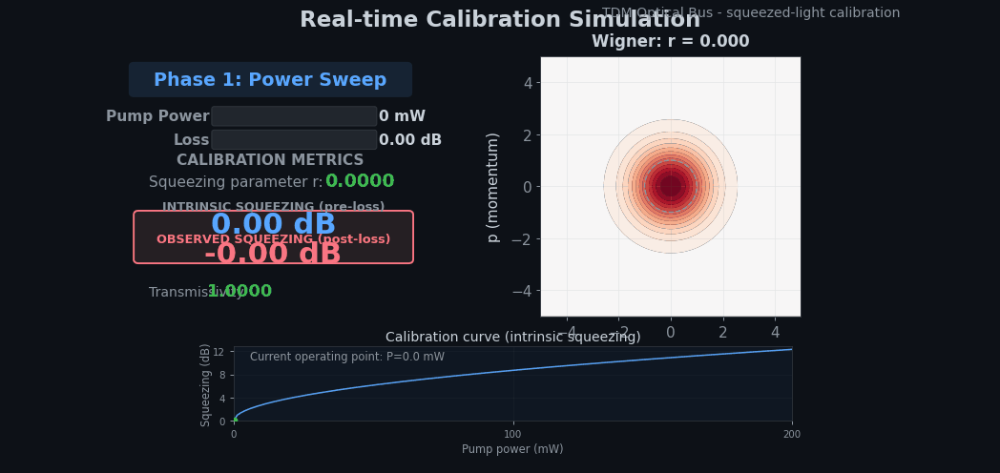

> **Figure 1: Real-time Calibration Simulation.**  
> The GIF shows intrinsic squeezing (pre-loss), which is constant for a fixed pump power, and observed squeezing (post-loss), which decreases as propagation loss increases.

This figure validates the mapping $r\propto\sqrt{P}$ and the decoherence effect of the pure-loss channel.

---

## Architecture

Below is a “component view” of the codebase with clear boundaries (UI vs. library modules) and the main “hot path” (slider inputs → simulation → plots), aligned with common architecture diagram best practices (start with context/boundaries, then zoom into components). :contentReference[oaicite:0]{index=0}

```mermaid
flowchart LR
  User([User])

  subgraph UI["UI / App (Streamlit)"]
    App["calibration_app.py<br/>orchestrator + rendering"]
  end

  subgraph Lib["quantum_optical_bus (Python package)"]
    Interface["interface.py<br/>P -> r mapping"]
    Units["units.py<br/>loss dB <-> T, scaling"]
    Quantum["quantum.py<br/>single-mode Gaussian ops"]
    Multi["multimode.py<br/>independent multi-mode/time-bin"]
    Topology["tdm_topology.py<br/>BS couplings by config"]
    Est["estimation.py<br/>fit eta & loss"]
    Ctrl["control.py<br/>phase drift + latency feedback"]
    HW["hardware.py<br/>optional Meep / analytic mock"]
  end

  subgraph Ext["External deps (optional)"]
    SF["Strawberry Fields<br/>(Gaussian backend)"]
    Meep["Meep (optional)<br/>eigenmode estimate"]
  end

  User -->|sliders: P, loss, theta, topology| App

  App -->|mode view / params| HW
  App -->|r=eta*sqrt(P)| Interface
  App -->|loss in dB| Units

  Interface --> Quantum
  Units --> Quantum
  Quantum -->|Wigner, cov, metrics| App

  App --> Multi
  App --> Topology
  Multi -->|per-mode metrics| App
  Topology -->|correlations| App

  App --> Est
  App --> Ctrl
  Est -->|eta_hat, loss_hat| App
  Ctrl -->|residual/error metrics| App

  Quantum -.-> SF
  Multi -.-> SF
  Topology -.-> SF
  HW -.-> Meep
```

The dashboard application (`src/quantum_optical_bus/calibration_app.py`) is the orchestrator: it reads UI inputs, runs the computational modules, and renders Wigner functions, quadrature plots, and control/fitting diagnostics.

### Responsibility table

| Layer | File | Responsibility |
|---|---|---|
| Hardware | `src/quantum_optical_bus/hardware.py` | Runs Meep eigenmode attempt when installed and always falls back to analytical Gaussian mock; returns fundamental-mode profile, effective index, and mode area. |
| Mapping | `src/quantum_optical_bus/interface.py` | Defines pump-power mapping used in dashboards: $r=\eta\sqrt{P}$. |
| Units | `src/quantum_optical_bus/units.py` | Converts dB loss to transmissivity (`db_to_eta`) and rescales covariance to vacuum=0.5 convention (`sf_cov_to_vacuum05`). |
| Quantum engine | `src/quantum_optical_bus/quantum.py` | `run_single_mode`: applies `Sgate`, optional `Rgate`, optional `LossChannel`, returns Wigner/covariance metrics (`mean_photon`, `var_x`, `var_p`, observed squeezing / anti-squeezing). |
| Multimode extension | `src/quantum_optical_bus/multimode.py` | `run_multimode`: per-mode independent `Sgate` / `Rgate` / `LossChannel` pipeline with optional Wigner extraction. |
| Topology extension | `src/quantum_optical_bus/tdm_topology.py` | `simulate_topology`: per-mode local gates plus ordered BS couplings from config, returns mode covariances and neighbor correlations. |
| Calibration / digital twin | `src/quantum_optical_bus/estimation.py` | `fit_eta_and_loss`: nonlinear fit of `eta` and loss to measured variance/squeezing curves. |
| Control loop | `src/quantum_optical_bus/control.py` | Simulates phase drift (`simulate_phase_drift`) and latency-limited feedback (`apply_feedback_with_latency`), outputs residual/error retention metrics. |
| Orchestrator UI | `src/quantum_optical_bus/calibration_app.py` | Streamlit app that wires all modules, computes derived quantities, and presents phase workflows (hardware view, calibration, single-mode, multi-mode, topology, and digital twin). |

### Roadmap notes (source-based and current scope)

- `hardware.py` includes a hardware simulation path but does not drive the live calibration map $r$ in the current MVP.
- `interface.py` keeps the squeezing coupling $\eta$ as a phenomenological parameter rather than a value extracted from hardware overlap integrals.
- `tdm_topology.py` uses a static sequence of configured couplings in MVP form (no full timing jitter/hardware dispatch layer).

For more implementation details, assumptions, and module interaction notes, see [`docs/ARCHITECTURE.md`](docs/ARCHITECTURE.md).

---

## Hardware-in-the-Loop Expansion

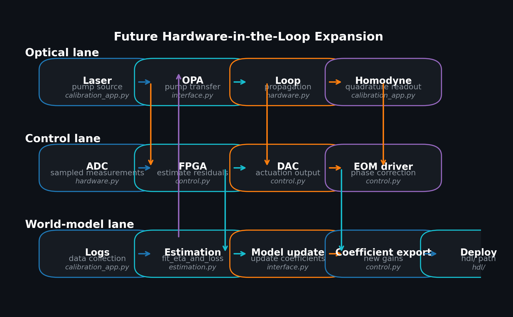

> **Figure 2: Future Hardware-in-the-Loop expansion plan.**

The roadmap adds a hardware-aware loop:

- optical path (laser/OPA/loop/homodyne),
- control path (ADC/FPGA/DAC/EOM driver),
- world-model path (`estimation.py` → updated controller coefficients → `hdl` deployment).

---

## Scenario Gallery

| Scenario | Image |
|---|---|
| **1. Vacuum Baseline (P = 0 mW)** | 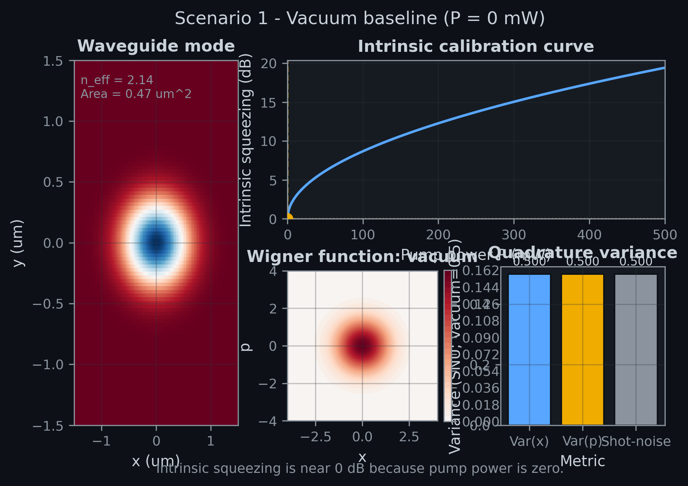 |
| **2. Squeezed State (P = 200 mW)** | 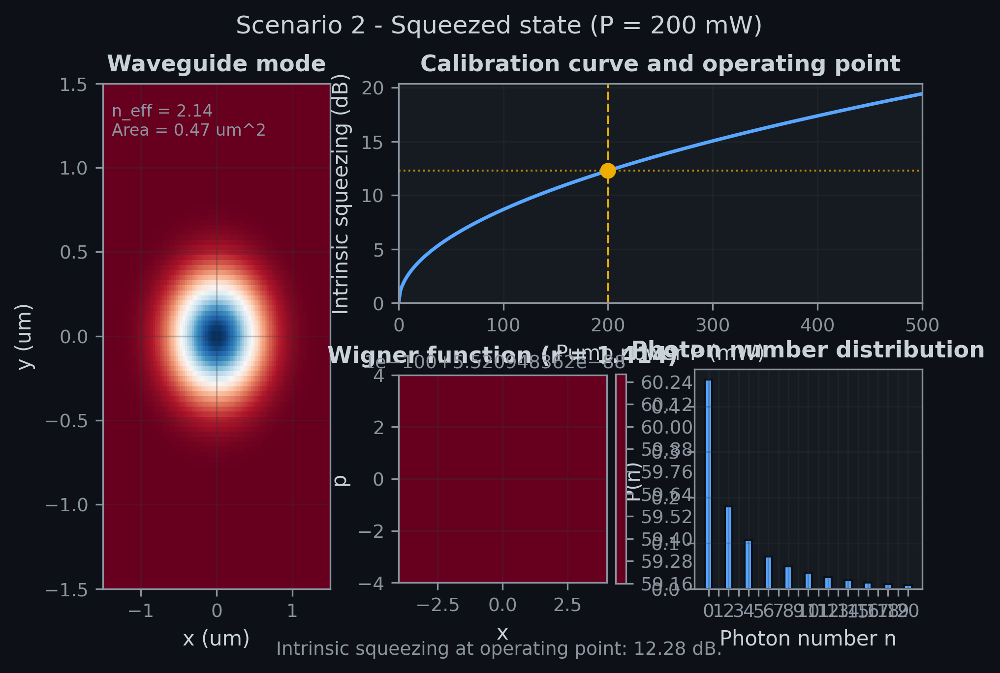 |
| **3. Decoherence (Pure vs Lossy)** | 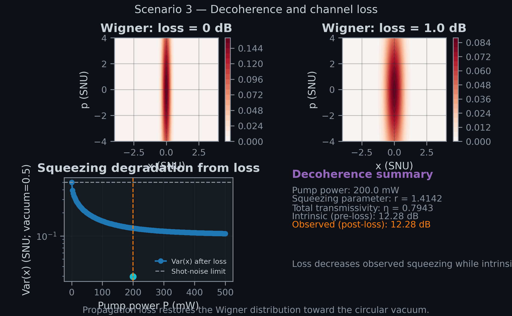 |

### Scenario Gallery GIF

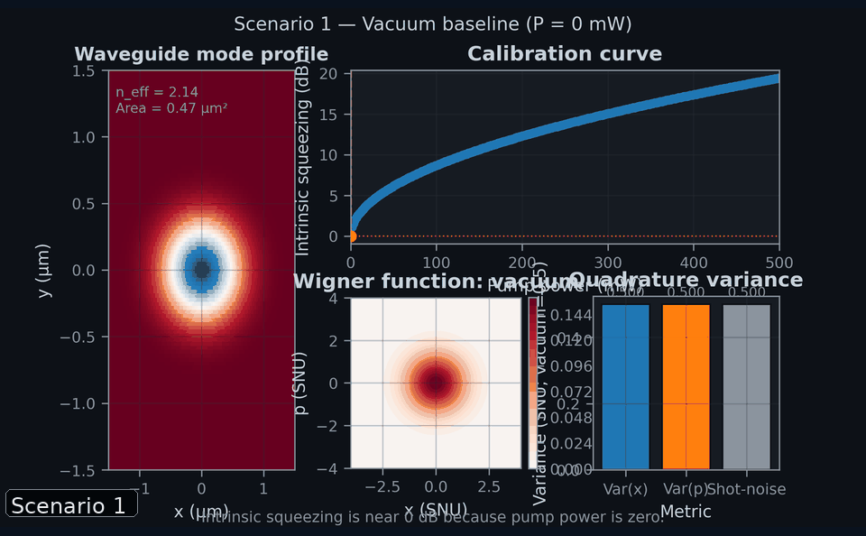

---

## Advanced Gallery

| Scenario | Image |
|---|---|
| **4. Multi-mode / Time-bin Simulator** | 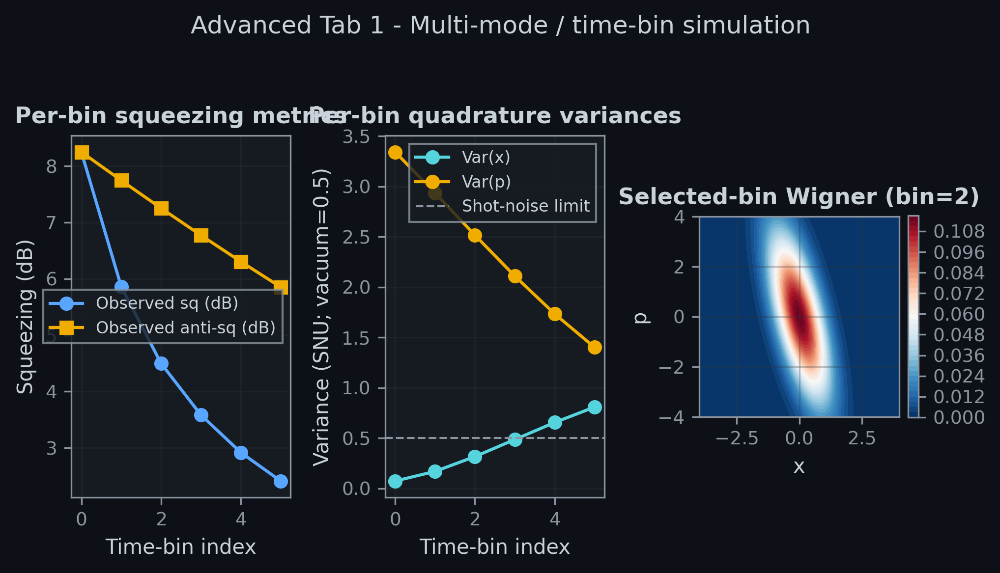 |
| **5. Topology Simulator** | 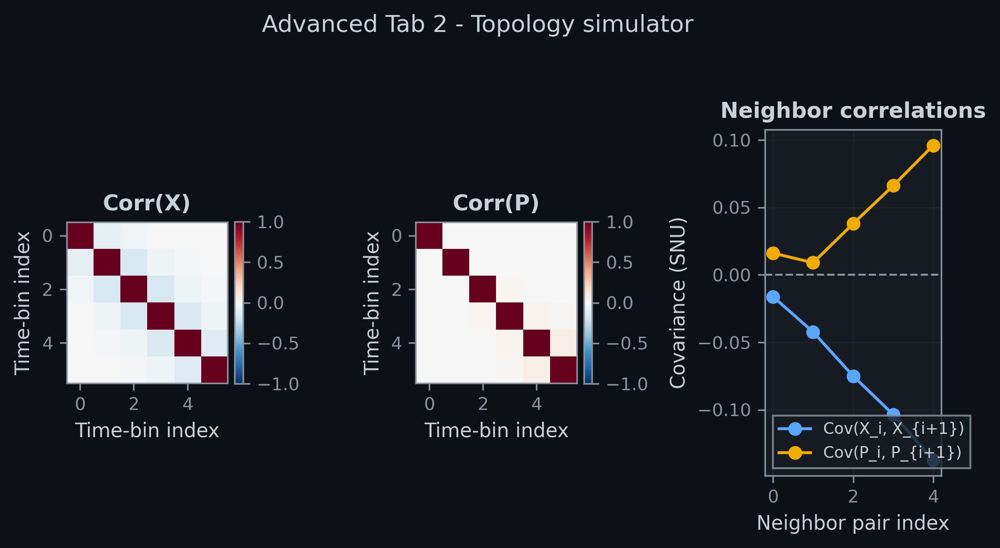 |
| **6. Digital Twin + Control** | 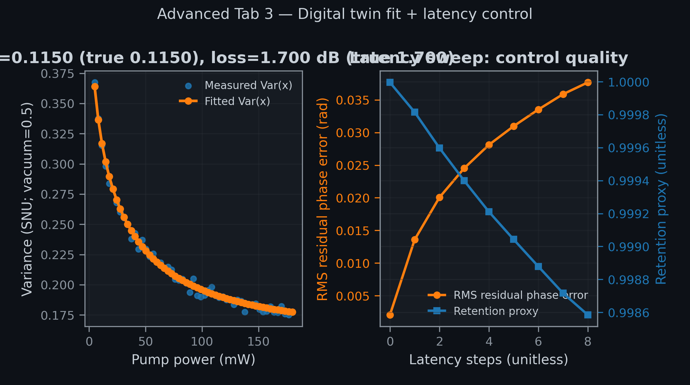 |

### Advanced Gallery GIF

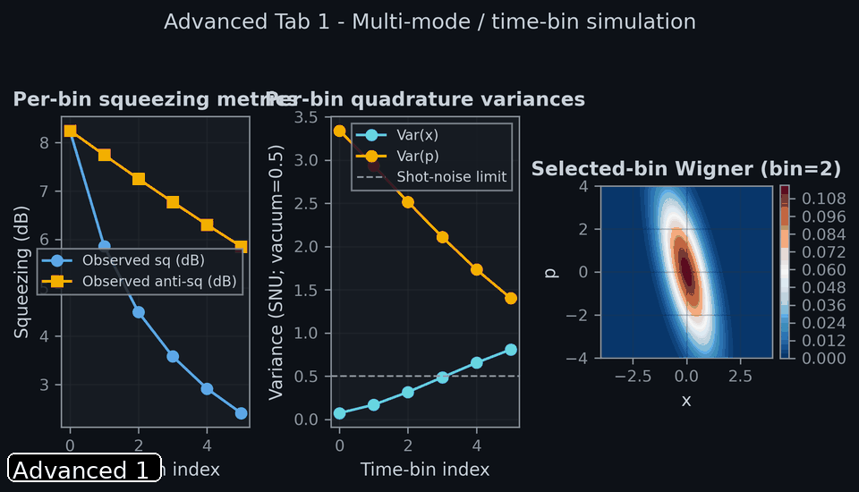

---

## Evidence Gallery

### Advanced Evidence GIF

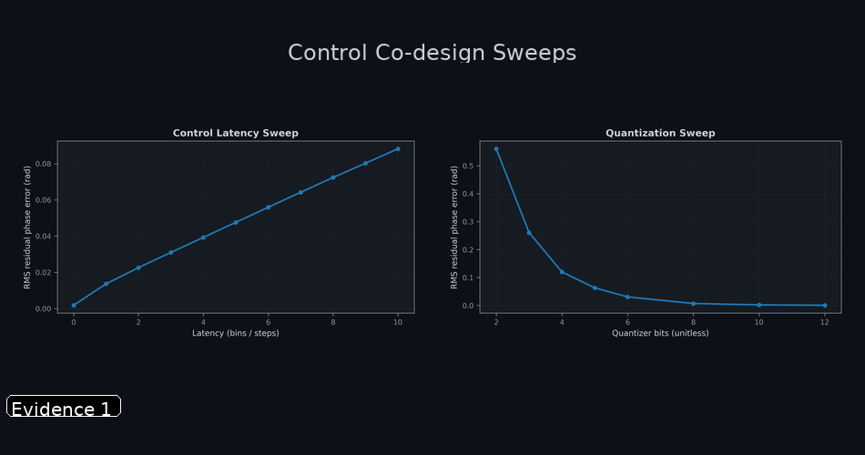

---

## Quick Start

```bash
# Install
pip install -e .

# Launch dashboard
streamlit run src/quantum_optical_bus/calibration_app.py
```

Then open **http://localhost:8501** and use the sidebar sliders.

### Docker Quick Start

Tested for Docker runtime with **Python 3.10** (Strawberry Fields compatibility).

```bash
docker build .
docker compose up --build
```

Then open **http://localhost:8501**.

### Language Notes

See translation versions in:

- `docs/README.ja.md`
- `docs/README.ko.md`
- `docs/README.zh.md`

### Additional Commands

| Task | Command |
|---|---|
| Generate Gallery Images | `python scripts/generate_dashboard_gallery.py` |
| Generate Advanced Gallery Images | `python scripts/generate_advanced_dashboard_gallery.py` |
| Generate Scenario Gallery GIF | `python scripts/generate_scenario_gallery_gif.py` |
| Generate Advanced Gallery GIF | `python scripts/generate_advanced_gallery_gif.py` |
| Generate Advanced Evidence GIF | `python scripts/generate_advanced_evidence_gif.py` |
| Generate HIL Infographic | `python scripts/generate_hil_infographic.py` |
| Generate Demo GIF | `python scripts/generate_calibration_demo.py` |

Topology config example:

```bash
python -c "from quantum_optical_bus.tdm_topology import simulate_topology; print(simulate_topology('examples/topology_chain.json').observed_sq_db)"
```

### Task Runner

This repository includes a minimal `Makefile`:

```bash
make test  # run pytest
make lint  # lightweight checks (python -m compileall src tests)
make app   # launch Streamlit dashboard
```

If `make` is unavailable (common on Windows shells), run:

```bash
python -m pytest -q
python -m compileall src tests
streamlit run src/quantum_optical_bus/calibration_app.py
```

---

## Model Definitions and Assumptions

### Squeezing parameter and control knob

The squeezing parameter is mapped from pump power:

$$
r=\eta\sqrt{P}
$$

This is a phenomenological control proxy, not yet a full hardware-derived parameter estimate.[^sqrtP_proxy]

$\eta=0.1$ is a placeholder coupling coefficient so that 100 mW approximates $r\approx 1.0$.

This is the source-side knob and is independent of downstream loss.

For a single-mode squeezed vacuum state, quadrature variance scales with the squeezing parameter as $V_x\propto e^{-2r}$ and $V_p\propto e^{+2r}$ (up to convention), which we use here as a modeling convention for visualization and diagnostics.[^squeezing_vacuum]

### Loss model

Propagation and detection losses are modeled as a pure-loss channel applied after squeezing:

$$
T = 10^{-\frac{\mathrm{loss}_{\mathrm{dB}}}{10}}
$$

This avoids KaTeX/LaTeX underscore parsing issues (the code variable is `loss_dB`, while the math uses $\mathrm{loss}_{\mathrm{dB}}$). :contentReference[oaicite:1]{index=1}

The forward relation for reporting power loss is:

$$
\mathrm{loss}_{\mathrm{dB}} = -10\log_{10}(T)
$$

and the channel model is:

$$
\hat{a}_{\text{out}}=\sqrt{T}\,\hat{a}_{\text{in}}+\sqrt{1-T}\,\hat{a}_{\text{vac}}
$$

Observed squeezing is derived from output covariances and tends to zero as $T\to 0$.

### Honest notes about placeholders

- `hardware.py` is optional Meep integration with analytic fallback; it is not yet a full production-calibration extractor.
- `interface.py` uses a fixed coupling map rather than measured overlap-based calibration.
- `tdm_topology.py` models an ordered static inter-bin coupling list with per-mode loss; it does not yet include full waveform/clock coupling effects.
- `multimode.py` is per-bin independent by design in the current version.
- `estimation.py` and `control.py` are MVP-level fitting + simplified drift/latency routines intended for study workflows.

[^sqrtP_proxy]: Proxy mapping for this repository's calibration demo: Squeezing lab manual for OPA characterization and power-law fitting guidance, https://indico.fysik.su.se/event/9433/contributions/14609/attachments/6285/8488/Squeezing_Lab_Manual_WACQT_Lab%20%281%29.pdf
[^squeezing_vacuum]: Quadrature-variance scaling in squeezed vacuum (with common conventions), https://mx.nthu.edu.tw/~rklee/files/QO-note-squeezed.pdf
[^db_conversion]: Standard power/attenuation conversion in dB used with the same laboratory notes: https://indico.fysik.su.se/event/9433/contributions/14609/attachments/6285/8488/Squeezing_Lab_Manual_WACQT_Lab%20%281%29.pdf

---

## Testing & CI

Tests run on Ubuntu, Windows, and macOS via GitHub Actions. Tested on Python 3.10 due to Strawberry Fields support.

```bash
pip install -e ".[test]"
python -m pytest -q
```

Roadmap and phased acceptance criteria are documented in `docs/ROADMAP.md`.

---

## Project Structure

```text
.
├── .github/workflows/ci.yml                 # CI: Ubuntu / Windows / macOS
├── src/
│   └── quantum_optical_bus/
│       ├── calibration_app.py               # Streamlit calibration dashboard
│       ├── quantum.py                       # Single-mode Gaussian circuit helper
│       ├── multimode.py                     # Independent multi-mode/time-bin Gaussian core
│       ├── tdm_topology.py                  # Config-driven topology + BS couplings
│       ├── estimation.py                    # Digital twin fitting (eta/loss)
│       ├── control.py                       # Drift and latency control simulation
│       ├── hardware.py                      # Meep / analytical mock interface
│       ├── interface.py                     # Power->squeezing mapping
│       ├── units.py                         # Units helpers and loss conversion
│       └── compat.py                        # Dependency patches
├── tests/
│   ├── test_core.py                         # Core simulator tests
│   └── test_digital_twin.py                 # Estimation/control tests
├── scripts/
│   ├── generate_calibration_demo.py         # Animated demo GIF
│   ├── generate_dashboard_gallery.py        # Baseline scenario images
│   ├── generate_advanced_dashboard_gallery.py
│   └── ...                                  # GIF and evidence generators
└── assets/                                  # Generated images and demo artifacts
```
