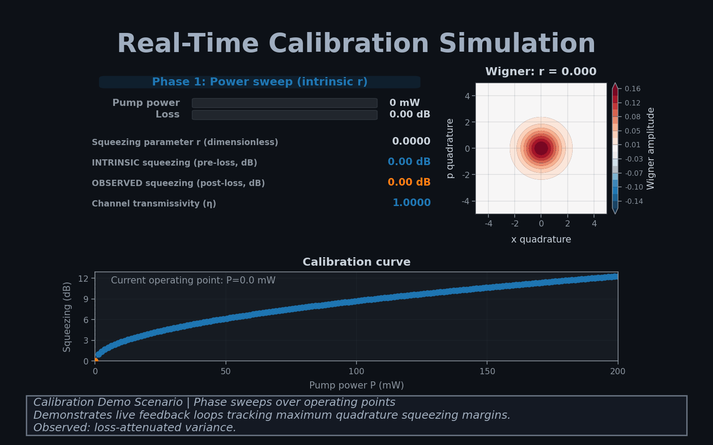

# Quantum Optical Bus Simulation

[](https://github.com/KumaHoon/Quantum-Optical-Bus-Simulation/actions/workflows/ci.yml)

A Python simulation and Streamlit dashboard for squeezed-light optical quantum systems.
Explore how pump power, optical loss, and control constraints affect observable squeezing in loop-based and time-domain-multiplexed (TDM) workflows.

## Demo



Pump power sets the source squeezing; optical loss reduces the squeezing observed at the detector.
See the [loss comparison](assets/web/dashboard_decoherence.png), [latency sweep](assets/web/sweep_latency.png), and [quantization sweep](assets/web/sweep_quantization.png) for static results.

## Features

- **Gaussian optics:** squeezed states, phase rotation, loss, and Wigner/covariance visualization.
- **TDM models:** multiple time bins, configurable beam-splitter networks, and per-mode loss.
- **Estimation and control:** parameter fitting, phase-feedback simulation, and synthetic drift recovery.
- **HDL prototype:** fixed-point nonlinear feedforward with a testbench and golden vectors; no board-level validation.

## Quick start

Clone the repository and run the following commands from its root:

```bash
git clone https://github.com/KumaHoon/Quantum-Optical-Bus-Simulation.git
cd Quantum-Optical-Bus-Simulation
```

### Docker

```bash
docker compose up --build
```

### Local Python

Use **Python 3.10** in an activated virtual environment.

```bash
python -m pip install -e .
python -m streamlit run src/quantum_optical_bus/calibration_app.py
```

Open [localhost:8501](http://localhost:8501) after starting either option.

## Model and limitations

- Source squeezing follows the phenomenological calibration model `r = eta * sqrt(P)`, with `P` in mW. The square-root pump-power scaling is consistent with standard squeezed-light / optical-parametric-amplifier models; the coefficient `eta` is an empirical calibration parameter and is not derived from hardware geometry or Meep [[1]](#references-for-model-equations).
- Squeezed-vacuum quadrature variance follows the standard scaling `V_sq ∝ exp(-2r)` [[1,2]](#references-for-model-equations).
- Optical attenuation is converted from decibels to power transmissivity as `T = 10^(-loss_db / 10)`; the simulation applies this transmissivity through a Gaussian pure-loss channel [[1]](#references-for-model-equations). The vacuum quadrature variance is set to `0.5` as the normalization convention used in this repository.
- Control and drift results are simulations. Latency, quantization, and drift ranges are engineering sweep assumptions rather than experimentally identified hardware parameters.
- This project does not demonstrate an experimental quantum computer, hardware-in-the-loop operation, or fault-tolerant computation.

### References for model equations

1. WACQT Laboratory, *Squeezing Lab Manual* — squeezed-light calibration model, pump-power dependence, quadrature variance, and optical attenuation conventions: <https://indico.fysik.su.se/event/9433/contributions/14609/attachments/6285/8488/Squeezing_Lab_Manual_WACQT_Lab%20%281%29.pdf>
2. R.-K. Lee, *Quantum Optics: Squeezed States* — squeezed-vacuum quadrature variance scaling `V ∝ exp(±2r)`: <https://mx.nthu.edu.tw/~rklee/files/QO-note-squeezed.pdf>

The longer bibliography and documentation notes are collected in [`docs/REFERENCES.md`](docs/REFERENCES.md).

## Reproduce results

Install the optional dependencies, run tests, and rebuild the core figures:

```bash
python -m pip install -e ".[demo,test]"
python -m pytest -q
python scripts/build_assets_profiles.py --profile both --target advisor --verify
```

Figures are written to `assets/web/` and `assets/paper/`. See the [evidence pack](docs/EVIDENCE_PACK.md) for individual claims, artifacts, and limitations.

## Documentation

| Document | Contents |
| --- | --- |
| [Project specification](docs/PROJECT_SPEC.md) | Goals, scope, and deliverables |
| [Architecture](docs/ARCHITECTURE.md) | Simulation and control pipeline |
| [Evidence pack](docs/EVIDENCE_PACK.md) | Results and their limitations |
| [Data schema](docs/data_schema.md) | Measurement data format |
| [Figure checklist](docs/figure_checklist.md) | Artifact requirements and verification |
| [Roadmap](docs/ROADMAP.md) | Planned extensions |
| [References](docs/REFERENCES.md) | Background literature |

For development commands, see [AGENTS.md](AGENTS.md).
For citation details, see [CITATION.cff](CITATION.cff). Licensed under [MIT](LICENSE).
