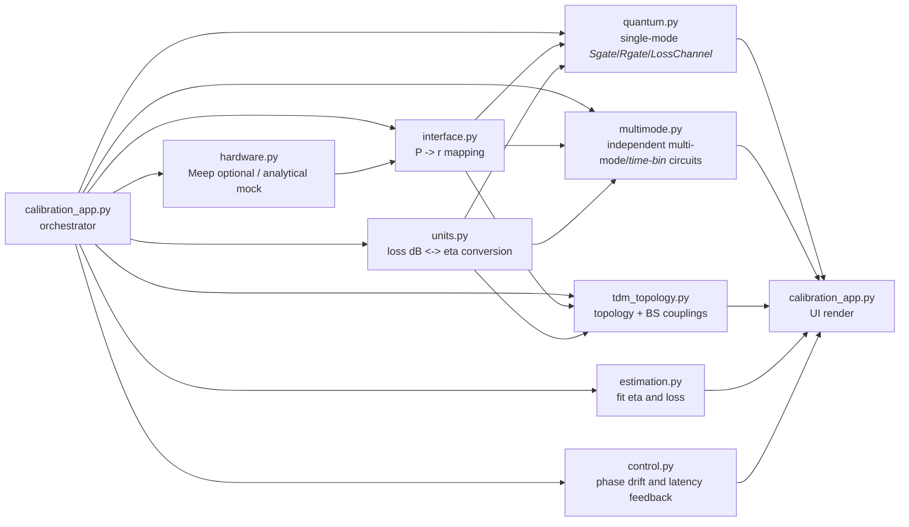

# 量子光学バス - 校正ダッシュボード

[English](../README.md) | 日本語 | [한국어](README.ko.md) | [中文](README.zh.md)

<i lang="en">One Waveguide (Hardware), Infinite States (Software)</i>を用いた、光量子計算とCV量子状態を結びつけるハイブリッドなシミュレーションです。ポンプ出力を固定した量子状態制御変数 $r=\eta\sqrt{P}$ と損失後観測値にマッピングし、キャリブレーションとデジタルツインを可視化します。

---

## ライブデモ

`calibration_demo.gif` は、ポンプ 0–200 mW の掃引（intrinsic）と、損失 0–2 dB の掃引（observed）によるワイガースアーチファクトを示します。

<p align="center">

</p>

> **Figure 1: リアルタイム校正シミュレーション。**
> <i lang="en">Intrinsic Squeezing (pre-loss)</i> はポンプで決まり一定値になり、  
> <i lang="en">Observed Squeezing (post-loss)</i> は損失で低下します。

---

## アーキテクチャ



`calibration_app.py` はUIの入力を集約し、計算モジュールを呼び出して <i lang="en">Wigner</i> 表示、二次モーメント、制御・適合診断を更新する調停役です。

### 責任表

| 層 | ファイル | 責務 |
|---|---|---|
| ハードウェア | `src/quantum_optical_bus/hardware.py` | Meepを使える場合は固有モードを推定し、未対応環境では解析モデルへフォールバック |
| 変換 | `src/quantum_optical_bus/interface.py` | 入力ポンプと圧縮係数の対応関係 $r=\eta\sqrt{P}$ を定義 |
| 単位 | `src/quantum_optical_bus/units.py` | dB損失と透過率の換算、および <i lang="en">Wigner</i> / 共分散可視化で用いるスケーリングを提供 |
| 量子エンジン | `src/quantum_optical_bus/quantum.py` | `run_single_mode` が <i lang="en">Sgate</i>/<i lang="en">Rgate</i>/<i lang="en">LossChannel</i> を構築し、観測量と <i lang="en">covariance</i> 指標を返す |
| 多モード拡張 | `src/quantum_optical_bus/multimode.py` | モードごとに独立な <i lang="en">time-bin</i> ガウス回路を評価 |
| トポロジ | `src/quantum_optical_bus/tdm_topology.py` | 設定トポロジーに基づくBS結合と経路損失を再現 |
| 推定 | `src/quantum_optical_bus/estimation.py` | `fit_eta_and_loss` による η および損失の同定 |
| 制御 | `src/quantum_optical_bus/control.py` | 位相ドリフトと遅延を含む簡略制御ループを提供 |
| オーケストレーターUI | `src/quantum_optical_bus/calibration_app.py` | サイドバー入力を受け取り、5段階ワークフローを表示 |

### ロードマップ（実装ベース）

- `hardware.py` は将来のキャリブレーション抽出を想定した構造ですが、現時点では推定パイプラインを完全代替していません。
- `interface.py` は重なり積分の実測値ではなく、固定係数での現象論的マッピングを採用しています。
- `tdm_topology.py` は現状静的な結合列を使う MVP で、完全な時間同期/ハードウェア制御統合までは含みません。

本リポジトリのモジュール間仕様は [`docs/ARCHITECTURE.md`](ARCHITECTURE.md) に詳細があります。

---

## ハードウェアインザループ拡張

<p align="center">

</p>

現在のロードマップは以下です。
- 光学経路（laser/OPA/loop/homodyne）
- 制御経路（ADC/FPGA/DAC/EOM driver）
- 世界モデル経路（`estimation.py` -> 制御係数更新 -> `hdl` 展開）

---

## シナリオギャラリー

| シナリオ | 画像 |
|---|---|
| **1. Vacuum Baseline (P = 0 mW)** |  |
| **2. Squeezed State (P = 200 mW)** |  |
| **3. Decoherence (Pure vs Lossy)** |  |

<details>
<summary>シナリオ GIF</summary>

<p align="center">

</p>

</details>

## 高度シナリオギャラリー

| シナリオ | 画像 |
|---|---|
| **4. Multi-mode / Time-bin Simulator** |  |
| **5. Topology Simulator** |  |
| **6. Digital Twin + Control** |  |

<details>
<summary>高度シナリオ GIF</summary>

<p align="center">

</p>

</details>

## Evidence ギャラリー

<details>
<summary>Evidence GIF</summary>

<p align="center">

</p>

</details>

---

## クイックスタート

```bash
# Install
pip install -e .

# Dashboard 起動
streamlit run src/quantum_optical_bus/calibration_app.py
```

ブラウザで **http://localhost:8501** を開き、サイドバーで設定を調整します。

### Docker クイックスタート

<i lang="en">Strawberry Fields</i> と Python 3.10 の互換実行環境で動作確認済みです。

```bash
docker build .
docker compose up --build
```

### 追加コマンド

| Task | Command |
|---|---|
| Dashboard 画像生成 | `python scripts/generate_dashboard_gallery.py` |
| Advanced Gallery 生成 | `python scripts/generate_advanced_dashboard_gallery.py` |
| Scenario GIF 生成 | `python scripts/generate_scenario_gallery_gif.py` |
| Advanced GIF 生成 | `python scripts/generate_advanced_gallery_gif.py` |
| Evidence GIF 生成 | `python scripts/generate_advanced_evidence_gif.py` |
| デモ GIF 生成 | `python scripts/generate_calibration_demo.py` |

### タスクランナー

このリポジトリには最小構成の Makefile があり、Windows では次のコマンドも利用可能です。

```bash
make test
make lint
make app
```

make が使えない環境では:

```bash
python -m pytest -q
python -m compileall src tests
streamlit run src/quantum_optical_bus/calibration_app.py
```

---

## モデル定義と前提

### 量子圧縮パラメータ

```math
r = \eta\sqrt{P}
```

### 損失モデル

```math
T = 10^{-\text{loss\_dB}/10}
```

```math
\hat{a}_{\text{out}} = \sqrt{T}\,\hat{a}_{\text{in}} + \sqrt{1-T}\,\hat{a}_{\text{vac}}
```

---

## テスト & CI

GitHub Actions で Ubuntu / Windows / macOS の3環境を実行しています。

```bash
pip install -e ".[test]"
python -m pytest -q
```

---

## プロジェクト構成

```
.
+-- .github/workflows/ci.yml           # CI: Ubuntu / Windows / macOS
+-- src/
    +-- quantum_optical_bus/
        +-- calibration_app.py
        +-- quantum.py
        +-- multimode.py
        +-- tdm_topology.py
        +-- estimation.py
        +-- control.py
        +-- hardware.py
        +-- interface.py
        +-- units.py
        +-- compat.py
+-- tests/
+-- scripts/
+-- assets/
```
