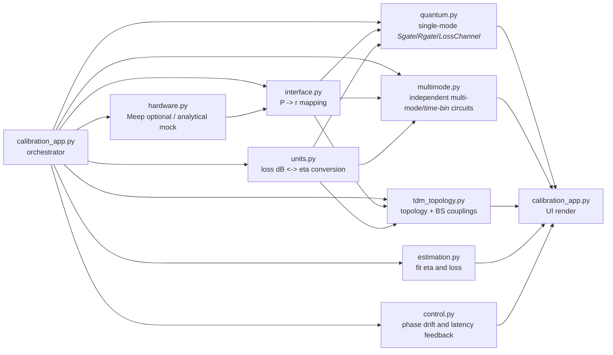

# 量子光学总线 - 校准仪表板

[English](../README.md) | [日本語](README.ja.md) | [한국어](README.ko.md) | 中文

这是一个混合量子-经典模拟项目，核心口号是 **<i lang="en">One Waveguide (Hardware), Infinite States (Software)</i>**。  
它通过从经典泵浦功率映射到连续变量(CV)压缩参数 $r=\eta\sqrt{P}$ 来展示“校准 + 可视化”流程，并在仿真中评估损耗与测量结果。

---

## 实时演示

`calibration_demo.gif` 展示了 0–200 mW 泵浦扫描（intrinsic）与 0–2 dB 损耗扫描（observed）对应的 <i lang="en">Wigner</i> 形状变化。

<p align="center">

</p>

> **Figure 1: 实时校准演示。**
> <i lang="en">Intrinsic Squeezing (pre-loss)</i> 由泵浦决定并较为稳定，  
> <i lang="en">Observed Squeezing (post-loss)</i> 随损耗增加而降低。

---

## 架构



`calibration_app.py` 作为总控器，读取侧栏参数，调用计算模块并更新 <i lang="en">Wigner</i> 图、<i lang="en">covariance</i> 指标和控制/拟合诊断。

### 责任表

| 层 | 文件 | 职责 |
|---|---|---|
| 硬件 | `src/quantum_optical_bus/hardware.py` | 支持 Meep 的模式估计；环境不支持时回退到分析 mock |
| 映射 | `src/quantum_optical_bus/interface.py` | 定义输入功率到 $r=\eta\sqrt{P}$ 的映射 |
| 单位换算 | `src/quantum_optical_bus/units.py` | dB 损耗与透过率转换，统一可视化标度 |
| 量子引擎 | `src/quantum_optical_bus/quantum.py` | `run_single_mode` 使用 <i lang="en">Sgate</i>/<i lang="en">Rgate</i>/<i lang="en">LossChannel</i> 并计算关键指标 |
| 多模扩展 | `src/quantum_optical_bus/multimode.py` | 每个模式独立处理 <i lang="en">time-bin</i> 结构 |
| 拓扑 | `src/quantum_optical_bus/tdm_topology.py` | 从配置构建 BS 连接序列并应用模式损耗 |
| 拟合 | `src/quantum_optical_bus/estimation.py` | `fit_eta_and_loss` 估计 η 与损耗 |
| 控制 | `src/quantum_optical_bus/control.py` | 含延迟的简化相位漂移反馈 |
| 编排 UI | `src/quantum_optical_bus/calibration_app.py` | 连接各模块并渲染场景流程 |

### 路线图说明（基于源码）

- `hardware.py` 保留硬件建模路径，但当前尚未演进为完整的在线标定提取器。
- `interface.py` 使用固定耦合参数的现象学映射，而非重叠积分得到的实测标定。
- `tdm_topology.py` 采用静态耦合序列的 MVP 实现，不包含完整时序抖动与硬件下发层。

更多模块交互说明见 [`docs/ARCHITECTURE.md`](ARCHITECTURE.md)。

---

## 硬件在环扩展

<p align="center">

</p>

当前路线图包含：
- 光学路径（laser/OPA/loop/homodyne）
- 控制路径（ADC/FPGA/DAC/EOM driver）
- 世界模型路径（`estimation.py` -> 控制系数更新 -> `hdl` 部署）

---

## 场景画廊

| 场景 | 图像 |
|---|---|
| **1. Vacuum Baseline (P = 0 mW)** |  |
| **2. Squeezed State (P = 200 mW)** |  |
| **3. Decoherence (Pure vs Lossy)** |  |

<details>
<summary>场景 GIF</summary>

<p align="center">

</p>

</details>

## 高级画廊

| 场景 | 图像 |
|---|---|
| **4. Multi-mode / Time-bin Simulator** |  |
| **5. Topology Simulator** |  |
| **6. Digital Twin + Control** |  |

<details>
<summary>高级 GIF</summary>

<p align="center">

</p>

</details>

## Evidence 画廊

<details>
<summary>Evidence GIF</summary>

<p align="center">

</p>

</details>

---

## 快速开始

```bash
# 安装
pip install -e .

# 启动仪表板
streamlit run src/quantum_optical_bus/calibration_app.py
```

打开 **http://localhost:8501**，使用侧边栏调节参数。

### Docker 快速开始

在 Python 3.10 下已验证与 <i lang="en">Strawberry Fields</i> 的兼容性。

```bash
docker build .
docker compose up --build
```

### 附加命令

| Task | Command |
|---|---|
| 生成场景图片 | `python scripts/generate_dashboard_gallery.py` |
| 生成高级场景图片 | `python scripts/generate_advanced_dashboard_gallery.py` |
| 生成场景 GIF | `python scripts/generate_scenario_gallery_gif.py` |
| 生成高级 GIF | `python scripts/generate_advanced_gallery_gif.py` |
| 生成 Evidence GIF | `python scripts/generate_advanced_evidence_gif.py` |
| 生成演示 GIF | `python scripts/generate_calibration_demo.py` |

### 任务命令

仓库包含 `Makefile`。

```bash
make test
make lint
make app
```

若无法使用 `make`：

```bash
python -m pytest -q
python -m compileall src tests
streamlit run src/quantum_optical_bus/calibration_app.py
```

---

## 模型定义与假设

### 压缩参数与控制量

```math
r = \eta\sqrt{P}
```

### 损耗模型

```math
T = 10^{-\text{loss\_dB}/10}
```

```math
\hat{a}_{\text{out}} = \sqrt{T}\,\hat{a}_{\text{in}} + \sqrt{1-T}\,\hat{a}_{\text{vac}}
```

---

## 测试与 CI

GitHub Actions 按 Ubuntu/Windows/macOS 执行回归测试。

```bash
pip install -e ".[test]"
python -m pytest -q
```

---

## 项目结构

```
.
+-- .github/workflows/ci.yml           # CI: Ubuntu / Windows / macOS
+-- src/
    +-- quantum_optical_bus/
        +-- calibration_app.py
        +-- quantum.py
        +-- multimode.py
        +-- tdm_topology.py
        +-- estimation.py
        +-- control.py
        +-- hardware.py
        +-- interface.py
        +-- units.py
        +-- compat.py
+-- tests/
+-- scripts/
+-- assets/
```
